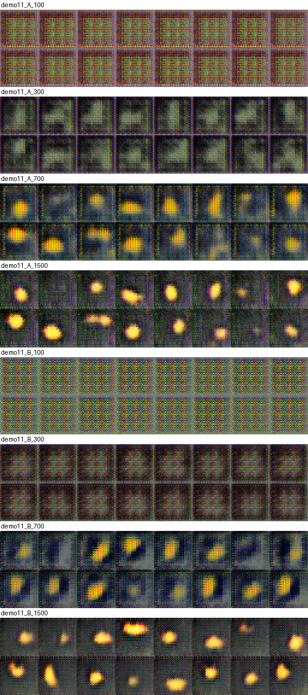

| Параметр | Содержание |
|---|---|
| Продолжительность | 2 академических часа (аудиторная работа); оформление отчёта — самостоятельно |
| Форма работы | индивидуально; вариант назначается по номеру в журнале группы (варианты 1–30) |
| Связь | лекция 7 (состязательная постановка, режимы отказа, разделы 1–3); ЛР 7 и ЛР 8 (те же синтетические сцены и критерий $2s$); ЛР 12 продолжает эту работу (устойчивость обучения), ЛР 13 заменяет метрики этой работы на FID |
| Индикаторы компетенций | ПК-6.1 (протокол эксперимента, базовый уровень); ПК-11.1 (безопасная и воспроизводимая работа с программными компонентами ИИ, базовый уровень) |
| Контроль | отчёт, таблица метрик, листы образцов, журнал потерь, устная защита |
| Программное обеспечение | среда Engee (проверено 20.09.2026: версия 26.8.2-H3, Python 3.11 из `/user/.user_venvs/py3.11`, PyTorch 2.4.1 на процессоре; графического ускорителя нет); внешние библиотеки, кроме PyTorch и NumPy, не нужны |
| Данные и лицензии | синтетические сцены 32×32 из `lab07_lib.py` (ЛР 7) порождаются кодом, внешние данные и права на них не требуются |

# 1. Цель и результаты

**Цель.** Реализовать и обучить базовую GAN на простых синтетических изображениях, проследить за обучением по журналу потерь и образцам, измерить качество и разнообразие сгенерированных изображений и проверить одной серией экспериментов, как один из выборов конструкции (размерность шума, ширина генератора, скорость обучения, момент оптимизатора, нормализация, функция потерь) меняет результат.

**Результаты.** После работы студент:

1. записывает архитектуру, оптимизатор, скорость обучения, число шагов и seed эксперимента с GAN так, чтобы его можно было повторить;
2. объясняет, что оптимизируют генератор и дискриминатор на своих шагах, и различает ненасыщающую и исходную минимаксную потери генератора;
3. отличает по журналу потерь и образцам нормальный ход обучения от «дискриминатор победил» и от схлопывания разнообразия;
4. измеряет отдельно правдоподобие каждого изображения и охват разнообразия данных, не смешивая их с потерей;
5. сравнивает два режима обучения на пяти seed и отделяет разность, превосходящую разброс между seed, от случайной.

# 2. Теоретический минимум

## 2.1. Состязательное обучение и порядок шагов

Генератор $G$ превращает вектор шума $z\sim\mathcal N(0,I)$ в изображение, дискриминатор $D$ выдаёт число — логит вероятности того, что изображение настоящее (лекция 7, разделы 1–2). Один шаг обучения — пара обновлений. (1) Из обучающего набора берётся пакет реальных изображений, из генератора — пакет поддельных; $D$ обновляется так, чтобы повысить оценку реальных и понизить оценку поддельных (кросс-энтропия). (2) Берётся новый пакет шума; $G$ обновляется так, чтобы дискриминатор оценил его изображения как реальные. В **ненасыщающей** постановке (по умолчанию) генератор минимизирует $-\log D(G(z))$, в **исходной минимаксной** — $\log(1-D(G(z)))$: она даёт малый градиент, пока дискриминатор уверенно отвергает подделки (лекция 7, раздел 2; Goodfellow и др., arXiv:1406.2661). Потери двух сетей не являются мерой качества: пока одна сеть учится, меняется и цель другой.

## 2.2. Данные и сети

Данные — пять наборов сцен 32×32×3 из ЛР 7: «диск» (положение и размер диска), «диск и прямоугольник», «диск с шумом», «цветной диск» (оттенок — четвёртый фактор), «два диска». Обучающая выборка — 4096 изображений, тестовая — 1024 (одинаковые для всех запусков). Значения пикселей лежат в $[0,1]$, поэтому последний слой генератора — сигмоида.

Архитектура следует рекомендациям DCGAN (Radford и др., arXiv:1511.06434): транспонированные свёртки с шагом 2 и нормализация по пакету в генераторе, `LeakyReLU` с наклоном 0,2 без нормализации в дискриминаторе, оптимизатор Adam со скоростью $2\cdot10^{-4}$ и моментом $\beta_1=0{,}5$ (авторы сообщают, что скорость $10^{-3}$ оказалась слишком высокой, а $\beta_1=0{,}9$ вызывало колебания). Генератор: линейный слой из 32 чисел в $64\cdot4\cdot4$, три транспонированные свёртки 64→32→16→3; дискриминатор: три свёртки 3→16→32→64 и линейный слой в одно число. Шаги: 1500 обновлений пары сетей, пакет 64.

## 2.3. Метрики без Inception

Внешней оценивающей сети в этой работе нет (FID появится в ЛР 13), поэтому качество измеряется прямо в пространстве пикселей на 1024 сгенерированных и 1024 тестовых изображениях:

| Метрика | Что измеряет | Направление и ограничения |
|---|---|---|
| `nn_psnr` | средний PSNR, дБ, между сгенерированным изображением и ближайшим к нему тестовым | выше — каждая картинка ближе к какой-то настоящей (правдоподобие); ближайший сосед отвечает за правдоподобие, но не за разнообразие: генератор с одним удачным образцом получит высокое значение |
| `coverage` | доля тестовых изображений, в шар вокруг которых (радиус — расстояние до 20-го ближайшего соседа среди тестовых) попало хотя бы одно сгенерированное (Naeem и др., arXiv:2002.09797) | выше — генератор охватывает больше данных; от 0 до 1; значение 0 не означает «плохие картинки», а означает, что ни одна не попала в шар настоящих |
| `diversity` | среднее попарное расстояние между сгенерированными, делённое на такое же для тестовых | 1 — как у данных; заметно ниже 1 — схлопывание разнообразия; выше 1 — изображения разбросаны дальше, чем данные (обычно шум) |
| `seconds` | время обучения одной GAN, с | сравнивайте только внутри одного запуска (нагрузка процессора между запусками различается) |

Метрики считаются в пикселях, а не в признаках сети, поэтому они пригодны только для таких простых сцен; для естественных изображений пиксельные расстояния не отражают сходства (ЛР 13). Радиус для охвата взят по 20-му соседу, а не по 5-му, как в оригинальной работе: в предварительном прогоне (один seed, набор «диск», 1200 шагов) охват по 5-му соседу не превышал 0,06 у всех восьми режимов с 1200 шагами и вырос до 0,10 после 2500 шагов и до 0,46 после 4000 шагов, то есть при 1024 тестовых сценах и трёх факторах 5-й сосед слишком близок для обучения такой длины и метрика не различала бы режимы; по 20-му соседу те же режимы различаются.

## 2.4. Схема сравнения и значимость

Режим A — базовая GAN (таблица 2.5), режим B — та же GAN с одним изменением. Оба режима обучаются на seed 101…105 (одинаковые начальные веса не гарантируются: архитектуры B могут отличаться). По каждой метрике считаются: среднее режима A, выборочное стандартное отклонение $s$ режима A по seed, среднее режима B, разность $\Delta=\bar B-\bar A$, отношение $\lvert\Delta\rvert/s$ и признак $\lvert\Delta\rvert>2s$. Допуск на практическую пользу записывается до запуска (в образце: `nn_psnr` — 0,5 дБ; `coverage` — 0,10; `diversity` — 0,05). GAN на процессоре не побитово воспроизводима: повторный запуск даёт значения, отличающиеся на доли разброса между seed.

## 2.5. Шесть факторов

| № | Фактор (режим A → режим B) | Что проверяется |
|---:|---|---|
| 1 | размерность шума $z$: 32 → 8 | хватает ли восьми чисел для описания трёх–четырёх факторов сцены |
| 2 | ширина генератора: 1 → 0,5 (каналы 64/32/16 → 32/16/8) | влияет ли ёмкость генератора при неизменном дискриминаторе |
| 3 | скорость обучения обеих сетей: $2\cdot10^{-4}$ → $10^{-3}$ | справедливо ли для этих данных предупреждение авторов DCGAN |
| 4 | момент Adam: $\beta_1$ = 0,5 → 0,9 | то же для момента |
| 5 | нормализация по пакету в генераторе: есть → нет | нужна ли она для устойчивого обучения |
| 6 | потеря генератора: ненасыщающая → исходная минимаксная | приводит ли насыщение к потере градиента |

# 3. Постановка задачи

**Объект.** Пять наборов сцен и шесть факторов. Вариант $n$ = 1…30 задаёт набор $c=\lceil n/6\rceil$ (порядок: «диск», «диск и прямоугольник», «диск с шумом», «цветной диск», «два диска») и фактор $k=((n-1)\bmod 6)+1$ из таблицы 2.5.

**Вход.** Набор сцен, конфигурации A и B. **Результат.** Таблица четырёх метрик с признаком $2s$, лист образцов режимов A и B, журнал потерь и выходов дискриминатора, вывод о гипотезе, паспорт. **Что фиксируется:** набор данных, архитектура, оптимизатор, число шагов, пакет, seed, версии, число потоков. **Что варьируется:** один фактор. Гипотезы фиксируются в отчёте до первого запуска (шаг 2 раздела 6.1).

# 4. Подготовка среды

1. В Engee создайте папку `lr11` и загрузите в неё `lab07_lib.py` (ЛР 7) и `lab11_lib.py` (из архива работы).
2. Убедитесь, что PyTorch установлен: `import torch; print(torch.__version__)` — ожидается 2.4.1. Дополнительные библиотеки не нужны.
3. Потоки: библиотека сама вызывает `torch.set_num_threads(4)` (PyTorch по умолчанию видит 112 потоков при 5 ядрах); переменная среды `LAB_THREADS` меняет число потоков.
4. Одно обучение занимает около минуты на 4 потоках при одном процессе (раздел 6.3); вариант — 10 обучений (5 seed × 2 режима), то есть 10–15 минут.
5. Структура проекта: `lr11/` — код; `lr11/samples/` — листы образцов; `lr11/reports/` — отчёт и таблицы; `lr11/journal.md` — журнал.

Ограничение консоли Engee: длинную строку (свыше 1,5 КБ) набрать по символам нельзя, поэтому код кладите в файлы через панель «Файлы»; загруженный файл может получить суффикс `_1` при совпадении имени — проверьте `readdir()`. Фоновый запуск: ``run(pipeline(`$PY script.py`, stdin=devnull, stdout="out11.txt", stderr="err11.txt"), wait=false)``; после него консоль может перестать отвечать (перезапуск ядра процесс не останавливает). Сеанс Engee может завершиться сам (примерно через час или после зависания вкладки): запустите его заново на странице аккаунта; результаты, записанные в файлы, сохраняются.

# 5. План выполнения

1. **Вариант.** Определите набор $c$ и фактор $k$; выпишите конфигурации A и B из `lab11_lib.py` (`settings`). Результат: запись в отчёте.
2. **Гипотеза и допуск.** Запишите до запуска, как, по вашему мнению, изменятся три метрики и какую разность сочтёте практически значимой. Результат: раздел отчёта с датой раньше даты первого обучения.
3. **Проверка среды.** Команды раздела 4. Результат: версии в журнале.
4. **Одно обучение под наблюдением.** Обучите режим A на seed 101 с сохранением образцов на шагах 100, 300, 700 и 1500 (`train_gan(..., snapshots=..., on_snapshot=...)`), выведите кривые потерь и среднюю оценку $D$ на реальных и поддельных (`hist`). Результат: лист образцов по шагам и график.
5. **Запуск варианта.** `M = L.variant_summary(n)` (10 обучений). Результат: таблица четырёх метрик.
6. **Образцы A и B.** Сохраните по 32 образца каждого режима (seed 101) и опишите различия: форма, положение, цвет, артефакты, повторы. Результат: лист и 3–4 предложения.
7. **Оценка эффекта.** Для каждой из трёх главных метрик проверьте $\lvert\Delta\rvert>2s$ и сравните разность с допуском из шага 2. Результат: таблица, где метрика отнесена к одному из классов: значимо по $2s$, важно на практике, ни то ни другое.
8. **Потери и метрики.** Ответьте: изменилась ли потеря генератора в режиме B, и согласуется ли это с метриками? Результат: 3–4 предложения.
9. **Паспорт.** Дата, среда, версии, набор данных, конфигурации A и B, seed, число потоков. Результат: паспорт в отчёте.
10. **Оформление.** Отчёт строится по разделу 8; ответы на вопросы раздела 9 готовятся к защите.

**Чек-лист перед сдачей:** гипотеза и допуск датированы до запуска; менялся один фактор; использованы все пять seed; образцы просмотрены глазами; потери не использованы как мера качества; охват и разнообразие описаны отдельно от правдоподобия; паспорт полон.

# 6. Демонстрационный вариант

Вариант 1: набор 1 («диск»), фактор 1 (размерность шума $z$: 32 → 8).

## 6.1. Мини-задача, гипотеза и допуск

**Мини-задача.** Обучить базовую GAN ($z$ = 32) и GAN с $z$ = 8 на наборе «диск» и сравнить `nn_psnr`, `coverage` и `diversity` на пяти seed; отдельно проследить за обучением режима A на seed 101.

**Гипотеза (образец записи; записана до получения результатов расчёта).** (H1) Сцена «диск» задаётся тремя числами (положение, размер), поэтому размерность шума 8 достаточна: разность `nn_psnr` не превысит $2s$ и допуск 0,5 дБ. (H2) `coverage` не упадёт больше допуска 0,10. (H3) `diversity` не изменится больше допуска 0,05. (H4) По потерям обучение режима A выглядит «нормально» (потеря дискриминатора около $2\ln2\approx1{,}39$ не достигается — ниже), но качество при этом плохое на ранних шагах и растёт медленно; по одной потере этого не увидеть.

## 6.2. Команды

Демонстрационный вариант выполнен теми же функциями, что и в вашей работе (Engee, консоль Julia; `PY` — путь к Python из раздела 4):

```julia
cd("/user/ii-in-kt/lr11")
run(pipeline(`$PY run_lab.py 11 0`, stdin=devnull, stdout="out11.txt", stderr="err11.txt"), wait=false)
```

`run_lab.py 11 0` считает варианты 1–6 (набор «диск»); полный прогон всех 30 вариантов — пять процессов `run_lab.py 11 0…4` и сводка `summarize_lab.py 11` (приложение В) — нужен преподавателю. Ваш вариант можно выполнить и напрямую в Python: `import lab11_lib as L; L.variant_summary(n)`.

## 6.3. Результаты

**Условия** (Engee 26.8.2-H3, процессор, 20.09.2026; журнал — `demo_journal/engee_run_log.md`). Набор 1 «диск». Режим A — базовая GAN ($z$ = 32), режим B — $z$ = 8; 1500 шагов, пакет 64, seed 101…105. Вызов: `L.variant_summary(1)`; время одного обучения около 200 с при пяти параллельных процессах по одному потоку.

| Метрика | A | $s$ | B | $\Delta$ | $\lvert\Delta\rvert/s$ | $\lvert\Delta\rvert>2s$ |
|---|---:|---:|---:|---:|---:|:---:|
| `nn_psnr` | 20,22 | 0,85 | 19,52 | −0,70 | 0,8 | нет |
| `coverage` | 0,786 | 0,217 | 0,456 | −0,330 | 1,5 | нет |
| `diversity` | 0,917 | 0,034 | 0,949 | +0,032 | 0,9 | нет |
| `seconds` | 198,0 | 23,4 | 204,2 | +6,2 | 0,3 | нет |

Значения по seed для главных метрик: разности `nn_psnr` и `coverage` меняют знак между seed.

| seed | 101 | 102 | 103 | 104 | 105 |
|---|---:|---:|---:|---:|---:|
| `nn_psnr`, A | 19,66 | 19,87 | 21,36 | 20,86 | 19,37 |
| `nn_psnr`, B | 20,62 | 19,84 | 19,06 | 19,40 | 18,69 |
| B − A | +0,97 | −0,03 | −2,30 | −1,46 | −0,68 |
| `coverage`, A | 0,707 | 0,876 | 0,980 | 0,921 | 0,443 |
| `coverage`, B | 0,813 | 0,615 | 0,289 | 0,478 | 0,084 |
| B − A | +0,106 | −0,261 | −0,691 | −0,443 | −0,359 |

**Воспроизводимость.** Отдельное обучение под наблюдением (`demo_gan.py 11 1`, seed 101, снимки на шагах 100, 300, 700, 1500) дало на шаге 1500 `nn_psnr` A 19,66 и B 20,62, `coverage` 0,707 и 0,813 — те же значения, что и в первом столбце таблицы по seed: на процессоре при тех же seed и числе потоков обучение воспроизвелось в пределах выведенных знаков.

**Динамика обучения** (режимы A и B, seed 101; потери — среднее за последние 100 шагов перед снимком):

| Режим | шаг | `nn_psnr` | `coverage` | `diversity` | потеря $G$ | потеря $D$ | $D$ на реальных | $D$ на поддельных |
|---|---:|---:|---:|---:|---:|---:|---:|---:|
| A | 100 | 13,75 | 0,000 | 0,138 | 1,92 | 0,72 | 0,69 | 0,25 |
| A | 300 | 17,41 | 0,000 | 0,434 | 0,68 | 1,29 | 0,57 | 0,51 |
| A | 700 | 17,97 | 0,001 | 0,788 | 1,05 | 1,15 | 0,65 | 0,48 |
| A | 1500 | 19,66 | 0,707 | 0,940 | 0,80 | 1,32 | 0,55 | 0,49 |
| B | 100 | 13,33 | 0,000 | 0,126 | 2,05 | 0,63 | 0,71 | 0,20 |
| B | 300 | 17,13 | 0,000 | 0,161 | 0,80 | 1,23 | 0,58 | 0,46 |
| B | 700 | 17,75 | 0,000 | 0,744 | 1,25 | 0,93 | 0,70 | 0,38 |
| B | 1500 | 20,62 | 0,813 | 0,880 | 1,02 | 1,09 | 0,60 | 0,40 |

Листы образцов (по 16 изображений на шагах 100, 300, 700, 1500; на каждом шаге сверху режим A, ниже режим B; `demo_journal/demo11_sheet.png`):



**Глазами** (наблюдение автора по листу образцов, субъективное). Режим A: на шаге 100 все 16 кадров одинаковы — регулярная сетка артефактов транспонированных свёрток, объекта нет; на шаге 300 — тёмные размытые пятна разной формы; на шаге 700 у большинства кадров появляется жёлто-оранжевый диск разного положения и формы (часть вытянута), фон сине-серый с артефактами; на шаге 1500 диски разного размера и положения, несколько кадров почти без объекта, фон шумный. Режим B ($z$ = 8): на шаге 100 — та же сетка артефактов; на шаге 300 — почти однородные тёмные кадры без объекта (`diversity` 0,161); на шаге 700 диски в тёмных «рамках», у многих кадров похожий наклон; на шаге 1500 — диски с мягкими краями, положения различаются, пустых кадров нет. По виду режим B на шаге 1500 не хуже режима A, а по `coverage` на seed 101 лучше (0,813 против 0,707); по среднему за пять seed режим B уступает (0,456 против 0,786) при разбросе режима A 0,217.

## 6.4. Намеренно введённые ошибки

**Ошибка 1: вывод по одному seed.** На seed 101 режим B лучше режима A по обеим главным метрикам: `nn_psnr` 19,66 → 20,62 (Δ = +0,97), `coverage` 0,707 → 0,813 (Δ = +0,106): «размерность 8 даже лучше». На seed 103 картина обратная: `nn_psnr` 21,36 → 19,06 (Δ = −2,30), `coverage` 0,980 → 0,289 (Δ = −0,691). *Симптом:* разность `nn_psnr` меняет знак между seed (от −2,30 до +0,97). *Диагностика:* выписать значения по всем seed и сравнить с разбросом режима A. *Исправление:* обучить пять seed и указывать среднее, $s$ и признак $2s$ по правилу раздела 2.4.

**Ошибка 2: потеря генератора как мера качества.** По журналу (таблица динамики) на шаге 1500 потеря генератора режима A (0,80) ниже, чем режима B (1,02): «A лучше». Но на этом же seed 101 метрики говорят обратное: `nn_psnr` 19,66 у A и 20,62 у B, `coverage` 0,707 и 0,813. Кроме того, у режима A потеря генератора по шагам 100, 300, 700, 1500 равна 1,92; 0,68; 1,05; 0,80, то есть не убывает монотонно, а `nn_psnr` растёт с 13,75 до 19,66 дБ. *Симптом:* порядок режимов по потере противоположен порядку по метрикам. *Диагностика:* сопоставить потери с метриками и образцами на равных шагах. *Исправление:* качество оценивать по метрикам и образцам на отложенной выборке, потери — только для диагностики равновесия.

**Ошибка 3: сравнение при разном числе шагов.** Если сравнить режим A после 1500 шагов (`nn_psnr` 19,66, `coverage` 0,707) с режимом B после 700 шагов (17,75; 0,000), получится «режим B хуже на 1,91 дБ, охват нулевой». Но при равных 700 шагах у режима A `nn_psnr` 17,97 и `coverage` 0,001 — разница между режимами на порядок меньше (0,22 дБ). *Симптом:* «отставание» режима B почти исчезает при сопоставлении на одном шаге. *Диагностика:* сверить число шагов в паспортах A и B. *Исправление:* фиксировать число шагов одинаковым и сообщать метрики на одном шаге.

## 6.5. Вывод, ограничения и вопрос для обсуждения

| Гипотеза | Результат | Оценка |
|---|---|---|
| H1: разность `nn_psnr` не превысит $2s$ и допуск 0,5 дБ | Δ = −0,70, $\lvert\Delta\rvert/s$ = 0,8 | подтверждена частично: $2s$ не превышено, но среднее падение больше допуска |
| H2: `coverage` не упадёт больше допуска 0,10 | Δ = −0,330, $\lvert\Delta\rvert/s$ = 1,5 | не подтверждена практически; статистически $2s$ не превышено (разброс режима A 0,217) |
| H3: `diversity` изменится не больше 0,05 | Δ = +0,032 | подтверждена |
| H4: потеря $D$ режима A ниже $2\ln2\approx1{,}39$, а качество на ранних шагах плохое | потеря $D$ 1,32 на шаге 1500; `nn_psnr` 13,75 дБ на шаге 100 и 19,66 на шаге 1500 | подтверждена |

**Вывод по варианту 1.** Уменьшение размерности шума с 32 до 8 на наборе «диск» по пяти seed не привело к различию, превосходящему разброс режима A: ни по `nn_psnr`, ни по `coverage`, ни по `diversity` признак $2s$ не выполнен. Средние значения смещены в сторону ухудшения (`nn_psnr` −0,70 дБ, `coverage` −0,330), но при пяти seed и разбросе охвата режима A 0,217 этого недостаточно для вывода; правильная запись — «эффект не найден при пяти seed», а не «размерность 8 достаточна». Проверка на остальных четырёх наборах (варианты 7, 13, 19, 25) даёт тот же результат: ни в одном из пяти вариантов с этим фактором признак $2s$ не выполнен.

**Ограничения.** Пять seed и один набор на вариант; метрики в пикселях (годятся для простых сцен); разброс охвата режима A велик; число шагов 1500 недостаточно для сходимости (у режима A `coverage` на шаге 700 равен 0,001, на 1500 — 0,707); время обучения получено при пяти параллельных процессах и не сопоставимо между запусками. **Вопрос для обсуждения:** что нужно изменить в схеме сравнения (число seed, число шагов, метрика), чтобы отличить отсутствие эффекта размерности шума от нехватки статистической мощности?

# 7. Индивидуальные варианты (30)

Свой номер студент узнаёт из журнала группы. Все варианты одной сложности: 10 обучений (5 seed × 2 режима), четыре метрики, лист образцов. Для варианта $n$: набор $c=\lceil n/6\rceil$, фактор $k=((n-1)\bmod 6)+1$ (раздел 3).

| № | Набор данных | Фактор | Обязательный эксперимент | Критерий оценки | Ограничение или риск |
|---:|---|---|---|---|---|
| 1 | набор данных 1: набор «диск» (жёлтый диск на градиентном фоне; факторы — положение и размер) | размерность шума: 32 → 8 | Сравните режим A (базовая GAN: шум 32, ширина 1, скорости 2e-4, β1 = 0,5, нормализация в генераторе, ненасыщающая потеря, 1500 шагов, пакет 64) и режим B (изменён один фактор: размерность шума: 32 → 8) на набор «диск» (жёлтый диск на градиентном фоне; факторы — положение и размер): пять seed, метрики `nn_psnr`, `coverage`, `diversity`, `seconds`. Проверьте гипотезу: размерности шума 8 хватает для набора, у которого три–четыре фактора; сравните `coverage` и `nn_psnr` с допуском. На образцах отдельно оцените: остаётся ли диск ровным, одного размера и на однородном фоне, нет ли «двойников» и пятен. Сохраните образцы режима A на шагах 100, 300, 700 и 1500 и опишите динамику обучения. | Гипотеза и допуск записаны до запуска; изменён ровно один фактор; использованы все пять seed; образцы просмотрены и описаны; потеря генератора не использована как мера качества; охват и правдоподобие описаны отдельно. | Синтетические сцены не содержат персональных данных и прав третьих лиц. Число факторов набора (три или четыре) сравнивается с размерностью шума 8: вывод «хватает» относится к этому набору. |
| 2 | набор данных 1: набор «диск» (жёлтый диск на градиентном фоне; факторы — положение и размер) | ширина генератора: 1 → 0,5 | Сравните режим A (базовая GAN: шум 32, ширина 1, скорости 2e-4, β1 = 0,5, нормализация в генераторе, ненасыщающая потеря, 1500 шагов, пакет 64) и режим B (изменён один фактор: ширина генератора: 1 → 0,5) на набор «диск» (жёлтый диск на градиентном фоне; факторы — положение и размер): пять seed, метрики `nn_psnr`, `coverage`, `diversity`, `seconds`. Проверьте гипотезу: при вдвое меньшей ширине генератора правдоподобие `nn_psnr` падает больше допуска 0,5 дБ. На образцах отдельно оцените: остаётся ли диск ровным, одного размера и на однородном фоне, нет ли «двойников» и пятен. Сохраните образцы режима A на шагах 100, 300, 700 и 1500 и опишите динамику обучения. | Гипотеза и допуск записаны до запуска; изменён ровно один фактор; использованы все пять seed; образцы просмотрены и описаны; потеря генератора не использована как мера качества; охват и правдоподобие описаны отдельно. | Синтетические сцены не содержат персональных данных и прав третьих лиц. Ширина влияет и на время обучения (`seconds`): сообщайте отдельно. |
| 3 | набор данных 1: набор «диск» (жёлтый диск на градиентном фоне; факторы — положение и размер) | скорость обучения: 2e-4 → 1e-3 | Сравните режим A (базовая GAN: шум 32, ширина 1, скорости 2e-4, β1 = 0,5, нормализация в генераторе, ненасыщающая потеря, 1500 шагов, пакет 64) и режим B (изменён один фактор: скорость обучения: 2e-4 → 1e-3) на набор «диск» (жёлтый диск на градиентном фоне; факторы — положение и размер): пять seed, метрики `nn_psnr`, `coverage`, `diversity`, `seconds`. Проверьте гипотезу авторов DCGAN: скорость 1e-3 слишком высока для этих данных; оцените `nn_psnr` и `coverage` и вид образцов. На образцах отдельно оцените: остаётся ли диск ровным, одного размера и на однородном фоне, нет ли «двойников» и пятен. Сохраните образцы режима A на шагах 100, 300, 700 и 1500 и опишите динамику обучения. | Гипотеза и допуск записаны до запуска; изменён ровно один фактор; использованы все пять seed; образцы просмотрены и описаны; потеря генератора не использована как мера качества; охват и правдоподобие описаны отдельно. | Синтетические сцены не содержат персональных данных и прав третьих лиц. При высокой скорости возможен отказ обучения: приведите образцы и оценки дискриминатора. |
| 4 | набор данных 1: набор «диск» (жёлтый диск на градиентном фоне; факторы — положение и размер) | момент Adam β1: 0,5 → 0,9 | Сравните режим A (базовая GAN: шум 32, ширина 1, скорости 2e-4, β1 = 0,5, нормализация в генераторе, ненасыщающая потеря, 1500 шагов, пакет 64) и режим B (изменён один фактор: момент Adam β1: 0,5 → 0,9) на набор «диск» (жёлтый диск на градиентном фоне; факторы — положение и размер): пять seed, метрики `nn_psnr`, `coverage`, `diversity`, `seconds`. Проверьте гипотезу авторов DCGAN: момент 0,9 вызывает колебания; сравните разброс метрик между seed режимов A и B. На образцах отдельно оцените: остаётся ли диск ровным, одного размера и на однородном фоне, нет ли «двойников» и пятен. Сохраните образцы режима A на шагах 100, 300, 700 и 1500 и опишите динамику обучения. | Гипотеза и допуск записаны до запуска; изменён ровно один фактор; использованы все пять seed; образцы просмотрены и описаны; потеря генератора не использована как мера качества; охват и правдоподобие описаны отдельно. | Синтетические сцены не содержат персональных данных и прав третьих лиц. Разброс между seed при 5 запусках оценён грубо: вывод о колебаниях предварительный. |
| 5 | набор данных 1: набор «диск» (жёлтый диск на градиентном фоне; факторы — положение и размер) | нормализация по пакету в генераторе: есть → нет | Сравните режим A (базовая GAN: шум 32, ширина 1, скорости 2e-4, β1 = 0,5, нормализация в генераторе, ненасыщающая потеря, 1500 шагов, пакет 64) и режим B (изменён один фактор: нормализация по пакету в генераторе: есть → нет) на набор «диск» (жёлтый диск на градиентном фоне; факторы — положение и размер): пять seed, метрики `nn_psnr`, `coverage`, `diversity`, `seconds`. Проверьте гипотезу: без нормализации в генераторе обучение за 1500 шагов идёт хуже (ниже `nn_psnr` и `coverage`). На образцах отдельно оцените: остаётся ли диск ровным, одного размера и на однородном фоне, нет ли «двойников» и пятен. Сохраните образцы режима A на шагах 100, 300, 700 и 1500 и опишите динамику обучения. | Гипотеза и допуск записаны до запуска; изменён ровно один фактор; использованы все пять seed; образцы просмотрены и описаны; потеря генератора не использована как мера качества; охват и правдоподобие описаны отдельно. | Синтетические сцены не содержат персональных данных и прав третьих лиц. Без нормализации результат чувствителен к seed: смотрите все пять значений, а не среднее. |
| 6 | набор данных 1: набор «диск» (жёлтый диск на градиентном фоне; факторы — положение и размер) | потеря генератора: ненасыщающая → минимаксная | Сравните режим A (базовая GAN: шум 32, ширина 1, скорости 2e-4, β1 = 0,5, нормализация в генераторе, ненасыщающая потеря, 1500 шагов, пакет 64) и режим B (изменён один фактор: потеря генератора: ненасыщающая → минимаксная) на набор «диск» (жёлтый диск на градиентном фоне; факторы — положение и размер): пять seed, метрики `nn_psnr`, `coverage`, `diversity`, `seconds`. Проверьте гипотезу: минимаксная потеря при нормальной паре скоростей даёт тот же результат в пределах разброса (насыщение вредит только при сильном дискриминаторе). На образцах отдельно оцените: остаётся ли диск ровным, одного размера и на однородном фоне, нет ли «двойников» и пятен. Сохраните образцы режима A на шагах 100, 300, 700 и 1500 и опишите динамику обучения. | Гипотеза и допуск записаны до запуска; изменён ровно один фактор; использованы все пять seed; образцы просмотрены и описаны; потеря генератора не использована как мера качества; охват и правдоподобие описаны отдельно. | Синтетические сцены не содержат персональных данных и прав третьих лиц. Вывод о потерях относится к паре скоростей режима A и не переносится на сильный дискриминатор (ЛР 12). |
| 7 | набор данных 2: набор «диск и прямоугольник» (плюс зелёный прямоугольник; четыре фактора) | размерность шума: 32 → 8 | Сравните режим A (базовая GAN: шум 32, ширина 1, скорости 2e-4, β1 = 0,5, нормализация в генераторе, ненасыщающая потеря, 1500 шагов, пакет 64) и режим B (изменён один фактор: размерность шума: 32 → 8) на набор «диск и прямоугольник» (плюс зелёный прямоугольник; четыре фактора): пять seed, метрики `nn_psnr`, `coverage`, `diversity`, `seconds`. Проверьте гипотезу: размерности шума 8 хватает для набора, у которого три–четыре фактора; сравните `coverage` и `nn_psnr` с допуском. На образцах отдельно оцените: присутствует ли прямоугольник в нижней части кадра и не сливается ли он с фоном. Сохраните образцы режима A на шагах 100, 300, 700 и 1500 и опишите динамику обучения. | Гипотеза и допуск записаны до запуска; изменён ровно один фактор; использованы все пять seed; образцы просмотрены и описаны; потеря генератора не использована как мера качества; охват и правдоподобие описаны отдельно. | Синтетические сцены не содержат персональных данных и прав третьих лиц. Число факторов набора (три или четыре) сравнивается с размерностью шума 8: вывод «хватает» относится к этому набору. |
| 8 | набор данных 2: набор «диск и прямоугольник» (плюс зелёный прямоугольник; четыре фактора) | ширина генератора: 1 → 0,5 | Сравните режим A (базовая GAN: шум 32, ширина 1, скорости 2e-4, β1 = 0,5, нормализация в генераторе, ненасыщающая потеря, 1500 шагов, пакет 64) и режим B (изменён один фактор: ширина генератора: 1 → 0,5) на набор «диск и прямоугольник» (плюс зелёный прямоугольник; четыре фактора): пять seed, метрики `nn_psnr`, `coverage`, `diversity`, `seconds`. Проверьте гипотезу: при вдвое меньшей ширине генератора правдоподобие `nn_psnr` падает больше допуска 0,5 дБ. На образцах отдельно оцените: присутствует ли прямоугольник в нижней части кадра и не сливается ли он с фоном. Сохраните образцы режима A на шагах 100, 300, 700 и 1500 и опишите динамику обучения. | Гипотеза и допуск записаны до запуска; изменён ровно один фактор; использованы все пять seed; образцы просмотрены и описаны; потеря генератора не использована как мера качества; охват и правдоподобие описаны отдельно. | Синтетические сцены не содержат персональных данных и прав третьих лиц. Ширина влияет и на время обучения (`seconds`): сообщайте отдельно. |
| 9 | набор данных 2: набор «диск и прямоугольник» (плюс зелёный прямоугольник; четыре фактора) | скорость обучения: 2e-4 → 1e-3 | Сравните режим A (базовая GAN: шум 32, ширина 1, скорости 2e-4, β1 = 0,5, нормализация в генераторе, ненасыщающая потеря, 1500 шагов, пакет 64) и режим B (изменён один фактор: скорость обучения: 2e-4 → 1e-3) на набор «диск и прямоугольник» (плюс зелёный прямоугольник; четыре фактора): пять seed, метрики `nn_psnr`, `coverage`, `diversity`, `seconds`. Проверьте гипотезу авторов DCGAN: скорость 1e-3 слишком высока для этих данных; оцените `nn_psnr` и `coverage` и вид образцов. На образцах отдельно оцените: присутствует ли прямоугольник в нижней части кадра и не сливается ли он с фоном. Сохраните образцы режима A на шагах 100, 300, 700 и 1500 и опишите динамику обучения. | Гипотеза и допуск записаны до запуска; изменён ровно один фактор; использованы все пять seed; образцы просмотрены и описаны; потеря генератора не использована как мера качества; охват и правдоподобие описаны отдельно. | Синтетические сцены не содержат персональных данных и прав третьих лиц. При высокой скорости возможен отказ обучения: приведите образцы и оценки дискриминатора. |
| 10 | набор данных 2: набор «диск и прямоугольник» (плюс зелёный прямоугольник; четыре фактора) | момент Adam β1: 0,5 → 0,9 | Сравните режим A (базовая GAN: шум 32, ширина 1, скорости 2e-4, β1 = 0,5, нормализация в генераторе, ненасыщающая потеря, 1500 шагов, пакет 64) и режим B (изменён один фактор: момент Adam β1: 0,5 → 0,9) на набор «диск и прямоугольник» (плюс зелёный прямоугольник; четыре фактора): пять seed, метрики `nn_psnr`, `coverage`, `diversity`, `seconds`. Проверьте гипотезу авторов DCGAN: момент 0,9 вызывает колебания; сравните разброс метрик между seed режимов A и B. На образцах отдельно оцените: присутствует ли прямоугольник в нижней части кадра и не сливается ли он с фоном. Сохраните образцы режима A на шагах 100, 300, 700 и 1500 и опишите динамику обучения. | Гипотеза и допуск записаны до запуска; изменён ровно один фактор; использованы все пять seed; образцы просмотрены и описаны; потеря генератора не использована как мера качества; охват и правдоподобие описаны отдельно. | Синтетические сцены не содержат персональных данных и прав третьих лиц. Разброс между seed при 5 запусках оценён грубо: вывод о колебаниях предварительный. |
| 11 | набор данных 2: набор «диск и прямоугольник» (плюс зелёный прямоугольник; четыре фактора) | нормализация по пакету в генераторе: есть → нет | Сравните режим A (базовая GAN: шум 32, ширина 1, скорости 2e-4, β1 = 0,5, нормализация в генераторе, ненасыщающая потеря, 1500 шагов, пакет 64) и режим B (изменён один фактор: нормализация по пакету в генераторе: есть → нет) на набор «диск и прямоугольник» (плюс зелёный прямоугольник; четыре фактора): пять seed, метрики `nn_psnr`, `coverage`, `diversity`, `seconds`. Проверьте гипотезу: без нормализации в генераторе обучение за 1500 шагов идёт хуже (ниже `nn_psnr` и `coverage`). На образцах отдельно оцените: присутствует ли прямоугольник в нижней части кадра и не сливается ли он с фоном. Сохраните образцы режима A на шагах 100, 300, 700 и 1500 и опишите динамику обучения. | Гипотеза и допуск записаны до запуска; изменён ровно один фактор; использованы все пять seed; образцы просмотрены и описаны; потеря генератора не использована как мера качества; охват и правдоподобие описаны отдельно. | Синтетические сцены не содержат персональных данных и прав третьих лиц. Без нормализации результат чувствителен к seed: смотрите все пять значений, а не среднее. |
| 12 | набор данных 2: набор «диск и прямоугольник» (плюс зелёный прямоугольник; четыре фактора) | потеря генератора: ненасыщающая → минимаксная | Сравните режим A (базовая GAN: шум 32, ширина 1, скорости 2e-4, β1 = 0,5, нормализация в генераторе, ненасыщающая потеря, 1500 шагов, пакет 64) и режим B (изменён один фактор: потеря генератора: ненасыщающая → минимаксная) на набор «диск и прямоугольник» (плюс зелёный прямоугольник; четыре фактора): пять seed, метрики `nn_psnr`, `coverage`, `diversity`, `seconds`. Проверьте гипотезу: минимаксная потеря при нормальной паре скоростей даёт тот же результат в пределах разброса (насыщение вредит только при сильном дискриминаторе). На образцах отдельно оцените: присутствует ли прямоугольник в нижней части кадра и не сливается ли он с фоном. Сохраните образцы режима A на шагах 100, 300, 700 и 1500 и опишите динамику обучения. | Гипотеза и допуск записаны до запуска; изменён ровно один фактор; использованы все пять seed; образцы просмотрены и описаны; потеря генератора не использована как мера качества; охват и правдоподобие описаны отдельно. | Синтетические сцены не содержат персональных данных и прав третьих лиц. Вывод о потерях относится к паре скоростей режима A и не переносится на сильный дискриминатор (ЛР 12). |
| 13 | набор данных 3: набор «диск с шумом» (гауссов шум σ = 0,05 на изображении) | размерность шума: 32 → 8 | Сравните режим A (базовая GAN: шум 32, ширина 1, скорости 2e-4, β1 = 0,5, нормализация в генераторе, ненасыщающая потеря, 1500 шагов, пакет 64) и режим B (изменён один фактор: размерность шума: 32 → 8) на набор «диск с шумом» (гауссов шум σ = 0,05 на изображении): пять seed, метрики `nn_psnr`, `coverage`, `diversity`, `seconds`. Проверьте гипотезу: размерности шума 8 хватает для набора, у которого три–четыре фактора; сравните `coverage` и `nn_psnr` с допуском. На образцах отдельно оцените: отличается ли шум на образцах от шума данных и не принят ли он за деталь. Сохраните образцы режима A на шагах 100, 300, 700 и 1500 и опишите динамику обучения. | Гипотеза и допуск записаны до запуска; изменён ровно один фактор; использованы все пять seed; образцы просмотрены и описаны; потеря генератора не использована как мера качества; охват и правдоподобие описаны отдельно. | Синтетические сцены не содержат персональных данных и прав третьих лиц. Число факторов набора (три или четыре) сравнивается с размерностью шума 8: вывод «хватает» относится к этому набору. |
| 14 | набор данных 3: набор «диск с шумом» (гауссов шум σ = 0,05 на изображении) | ширина генератора: 1 → 0,5 | Сравните режим A (базовая GAN: шум 32, ширина 1, скорости 2e-4, β1 = 0,5, нормализация в генераторе, ненасыщающая потеря, 1500 шагов, пакет 64) и режим B (изменён один фактор: ширина генератора: 1 → 0,5) на набор «диск с шумом» (гауссов шум σ = 0,05 на изображении): пять seed, метрики `nn_psnr`, `coverage`, `diversity`, `seconds`. Проверьте гипотезу: при вдвое меньшей ширине генератора правдоподобие `nn_psnr` падает больше допуска 0,5 дБ. На образцах отдельно оцените: отличается ли шум на образцах от шума данных и не принят ли он за деталь. Сохраните образцы режима A на шагах 100, 300, 700 и 1500 и опишите динамику обучения. | Гипотеза и допуск записаны до запуска; изменён ровно один фактор; использованы все пять seed; образцы просмотрены и описаны; потеря генератора не использована как мера качества; охват и правдоподобие описаны отдельно. | Синтетические сцены не содержат персональных данных и прав третьих лиц. Ширина влияет и на время обучения (`seconds`): сообщайте отдельно. |
| 15 | набор данных 3: набор «диск с шумом» (гауссов шум σ = 0,05 на изображении) | скорость обучения: 2e-4 → 1e-3 | Сравните режим A (базовая GAN: шум 32, ширина 1, скорости 2e-4, β1 = 0,5, нормализация в генераторе, ненасыщающая потеря, 1500 шагов, пакет 64) и режим B (изменён один фактор: скорость обучения: 2e-4 → 1e-3) на набор «диск с шумом» (гауссов шум σ = 0,05 на изображении): пять seed, метрики `nn_psnr`, `coverage`, `diversity`, `seconds`. Проверьте гипотезу авторов DCGAN: скорость 1e-3 слишком высока для этих данных; оцените `nn_psnr` и `coverage` и вид образцов. На образцах отдельно оцените: отличается ли шум на образцах от шума данных и не принят ли он за деталь. Сохраните образцы режима A на шагах 100, 300, 700 и 1500 и опишите динамику обучения. | Гипотеза и допуск записаны до запуска; изменён ровно один фактор; использованы все пять seed; образцы просмотрены и описаны; потеря генератора не использована как мера качества; охват и правдоподобие описаны отдельно. | Синтетические сцены не содержат персональных данных и прав третьих лиц. При высокой скорости возможен отказ обучения: приведите образцы и оценки дискриминатора. |
| 16 | набор данных 3: набор «диск с шумом» (гауссов шум σ = 0,05 на изображении) | момент Adam β1: 0,5 → 0,9 | Сравните режим A (базовая GAN: шум 32, ширина 1, скорости 2e-4, β1 = 0,5, нормализация в генераторе, ненасыщающая потеря, 1500 шагов, пакет 64) и режим B (изменён один фактор: момент Adam β1: 0,5 → 0,9) на набор «диск с шумом» (гауссов шум σ = 0,05 на изображении): пять seed, метрики `nn_psnr`, `coverage`, `diversity`, `seconds`. Проверьте гипотезу авторов DCGAN: момент 0,9 вызывает колебания; сравните разброс метрик между seed режимов A и B. На образцах отдельно оцените: отличается ли шум на образцах от шума данных и не принят ли он за деталь. Сохраните образцы режима A на шагах 100, 300, 700 и 1500 и опишите динамику обучения. | Гипотеза и допуск записаны до запуска; изменён ровно один фактор; использованы все пять seed; образцы просмотрены и описаны; потеря генератора не использована как мера качества; охват и правдоподобие описаны отдельно. | Синтетические сцены не содержат персональных данных и прав третьих лиц. Разброс между seed при 5 запусках оценён грубо: вывод о колебаниях предварительный. |
| 17 | набор данных 3: набор «диск с шумом» (гауссов шум σ = 0,05 на изображении) | нормализация по пакету в генераторе: есть → нет | Сравните режим A (базовая GAN: шум 32, ширина 1, скорости 2e-4, β1 = 0,5, нормализация в генераторе, ненасыщающая потеря, 1500 шагов, пакет 64) и режим B (изменён один фактор: нормализация по пакету в генераторе: есть → нет) на набор «диск с шумом» (гауссов шум σ = 0,05 на изображении): пять seed, метрики `nn_psnr`, `coverage`, `diversity`, `seconds`. Проверьте гипотезу: без нормализации в генераторе обучение за 1500 шагов идёт хуже (ниже `nn_psnr` и `coverage`). На образцах отдельно оцените: отличается ли шум на образцах от шума данных и не принят ли он за деталь. Сохраните образцы режима A на шагах 100, 300, 700 и 1500 и опишите динамику обучения. | Гипотеза и допуск записаны до запуска; изменён ровно один фактор; использованы все пять seed; образцы просмотрены и описаны; потеря генератора не использована как мера качества; охват и правдоподобие описаны отдельно. | Синтетические сцены не содержат персональных данных и прав третьих лиц. Без нормализации результат чувствителен к seed: смотрите все пять значений, а не среднее. |
| 18 | набор данных 3: набор «диск с шумом» (гауссов шум σ = 0,05 на изображении) | потеря генератора: ненасыщающая → минимаксная | Сравните режим A (базовая GAN: шум 32, ширина 1, скорости 2e-4, β1 = 0,5, нормализация в генераторе, ненасыщающая потеря, 1500 шагов, пакет 64) и режим B (изменён один фактор: потеря генератора: ненасыщающая → минимаксная) на набор «диск с шумом» (гауссов шум σ = 0,05 на изображении): пять seed, метрики `nn_psnr`, `coverage`, `diversity`, `seconds`. Проверьте гипотезу: минимаксная потеря при нормальной паре скоростей даёт тот же результат в пределах разброса (насыщение вредит только при сильном дискриминаторе). На образцах отдельно оцените: отличается ли шум на образцах от шума данных и не принят ли он за деталь. Сохраните образцы режима A на шагах 100, 300, 700 и 1500 и опишите динамику обучения. | Гипотеза и допуск записаны до запуска; изменён ровно один фактор; использованы все пять seed; образцы просмотрены и описаны; потеря генератора не использована как мера качества; охват и правдоподобие описаны отдельно. | Синтетические сцены не содержат персональных данных и прав третьих лиц. Вывод о потерях относится к паре скоростей режима A и не переносится на сильный дискриминатор (ЛР 12). |
| 19 | набор данных 4: набор «цветной диск» (оттенок диска — четвёртый фактор) | размерность шума: 32 → 8 | Сравните режим A (базовая GAN: шум 32, ширина 1, скорости 2e-4, β1 = 0,5, нормализация в генераторе, ненасыщающая потеря, 1500 шагов, пакет 64) и режим B (изменён один фактор: размерность шума: 32 → 8) на набор «цветной диск» (оттенок диска — четвёртый фактор): пять seed, метрики `nn_psnr`, `coverage`, `diversity`, `seconds`. Проверьте гипотезу: размерности шума 8 хватает для набора, у которого три–четыре фактора; сравните `coverage` и `nn_psnr` с допуском. На образцах отдельно оцените: совпадает ли оттенок диска с диапазоном оттенков данных и не смешиваются ли цвета. Сохраните образцы режима A на шагах 100, 300, 700 и 1500 и опишите динамику обучения. | Гипотеза и допуск записаны до запуска; изменён ровно один фактор; использованы все пять seed; образцы просмотрены и описаны; потеря генератора не использована как мера качества; охват и правдоподобие описаны отдельно. | Синтетические сцены не содержат персональных данных и прав третьих лиц. Число факторов набора (три или четыре) сравнивается с размерностью шума 8: вывод «хватает» относится к этому набору. |
| 20 | набор данных 4: набор «цветной диск» (оттенок диска — четвёртый фактор) | ширина генератора: 1 → 0,5 | Сравните режим A (базовая GAN: шум 32, ширина 1, скорости 2e-4, β1 = 0,5, нормализация в генераторе, ненасыщающая потеря, 1500 шагов, пакет 64) и режим B (изменён один фактор: ширина генератора: 1 → 0,5) на набор «цветной диск» (оттенок диска — четвёртый фактор): пять seed, метрики `nn_psnr`, `coverage`, `diversity`, `seconds`. Проверьте гипотезу: при вдвое меньшей ширине генератора правдоподобие `nn_psnr` падает больше допуска 0,5 дБ. На образцах отдельно оцените: совпадает ли оттенок диска с диапазоном оттенков данных и не смешиваются ли цвета. Сохраните образцы режима A на шагах 100, 300, 700 и 1500 и опишите динамику обучения. | Гипотеза и допуск записаны до запуска; изменён ровно один фактор; использованы все пять seed; образцы просмотрены и описаны; потеря генератора не использована как мера качества; охват и правдоподобие описаны отдельно. | Синтетические сцены не содержат персональных данных и прав третьих лиц. Ширина влияет и на время обучения (`seconds`): сообщайте отдельно. |
| 21 | набор данных 4: набор «цветной диск» (оттенок диска — четвёртый фактор) | скорость обучения: 2e-4 → 1e-3 | Сравните режим A (базовая GAN: шум 32, ширина 1, скорости 2e-4, β1 = 0,5, нормализация в генераторе, ненасыщающая потеря, 1500 шагов, пакет 64) и режим B (изменён один фактор: скорость обучения: 2e-4 → 1e-3) на набор «цветной диск» (оттенок диска — четвёртый фактор): пять seed, метрики `nn_psnr`, `coverage`, `diversity`, `seconds`. Проверьте гипотезу авторов DCGAN: скорость 1e-3 слишком высока для этих данных; оцените `nn_psnr` и `coverage` и вид образцов. На образцах отдельно оцените: совпадает ли оттенок диска с диапазоном оттенков данных и не смешиваются ли цвета. Сохраните образцы режима A на шагах 100, 300, 700 и 1500 и опишите динамику обучения. | Гипотеза и допуск записаны до запуска; изменён ровно один фактор; использованы все пять seed; образцы просмотрены и описаны; потеря генератора не использована как мера качества; охват и правдоподобие описаны отдельно. | Синтетические сцены не содержат персональных данных и прав третьих лиц. При высокой скорости возможен отказ обучения: приведите образцы и оценки дискриминатора. |
| 22 | набор данных 4: набор «цветной диск» (оттенок диска — четвёртый фактор) | момент Adam β1: 0,5 → 0,9 | Сравните режим A (базовая GAN: шум 32, ширина 1, скорости 2e-4, β1 = 0,5, нормализация в генераторе, ненасыщающая потеря, 1500 шагов, пакет 64) и режим B (изменён один фактор: момент Adam β1: 0,5 → 0,9) на набор «цветной диск» (оттенок диска — четвёртый фактор): пять seed, метрики `nn_psnr`, `coverage`, `diversity`, `seconds`. Проверьте гипотезу авторов DCGAN: момент 0,9 вызывает колебания; сравните разброс метрик между seed режимов A и B. На образцах отдельно оцените: совпадает ли оттенок диска с диапазоном оттенков данных и не смешиваются ли цвета. Сохраните образцы режима A на шагах 100, 300, 700 и 1500 и опишите динамику обучения. | Гипотеза и допуск записаны до запуска; изменён ровно один фактор; использованы все пять seed; образцы просмотрены и описаны; потеря генератора не использована как мера качества; охват и правдоподобие описаны отдельно. | Синтетические сцены не содержат персональных данных и прав третьих лиц. Разброс между seed при 5 запусках оценён грубо: вывод о колебаниях предварительный. |
| 23 | набор данных 4: набор «цветной диск» (оттенок диска — четвёртый фактор) | нормализация по пакету в генераторе: есть → нет | Сравните режим A (базовая GAN: шум 32, ширина 1, скорости 2e-4, β1 = 0,5, нормализация в генераторе, ненасыщающая потеря, 1500 шагов, пакет 64) и режим B (изменён один фактор: нормализация по пакету в генераторе: есть → нет) на набор «цветной диск» (оттенок диска — четвёртый фактор): пять seed, метрики `nn_psnr`, `coverage`, `diversity`, `seconds`. Проверьте гипотезу: без нормализации в генераторе обучение за 1500 шагов идёт хуже (ниже `nn_psnr` и `coverage`). На образцах отдельно оцените: совпадает ли оттенок диска с диапазоном оттенков данных и не смешиваются ли цвета. Сохраните образцы режима A на шагах 100, 300, 700 и 1500 и опишите динамику обучения. | Гипотеза и допуск записаны до запуска; изменён ровно один фактор; использованы все пять seed; образцы просмотрены и описаны; потеря генератора не использована как мера качества; охват и правдоподобие описаны отдельно. | Синтетические сцены не содержат персональных данных и прав третьих лиц. Без нормализации результат чувствителен к seed: смотрите все пять значений, а не среднее. |
| 24 | набор данных 4: набор «цветной диск» (оттенок диска — четвёртый фактор) | потеря генератора: ненасыщающая → минимаксная | Сравните режим A (базовая GAN: шум 32, ширина 1, скорости 2e-4, β1 = 0,5, нормализация в генераторе, ненасыщающая потеря, 1500 шагов, пакет 64) и режим B (изменён один фактор: потеря генератора: ненасыщающая → минимаксная) на набор «цветной диск» (оттенок диска — четвёртый фактор): пять seed, метрики `nn_psnr`, `coverage`, `diversity`, `seconds`. Проверьте гипотезу: минимаксная потеря при нормальной паре скоростей даёт тот же результат в пределах разброса (насыщение вредит только при сильном дискриминаторе). На образцах отдельно оцените: совпадает ли оттенок диска с диапазоном оттенков данных и не смешиваются ли цвета. Сохраните образцы режима A на шагах 100, 300, 700 и 1500 и опишите динамику обучения. | Гипотеза и допуск записаны до запуска; изменён ровно один фактор; использованы все пять seed; образцы просмотрены и описаны; потеря генератора не использована как мера качества; охват и правдоподобие описаны отдельно. | Синтетические сцены не содержат персональных данных и прав третьих лиц. Вывод о потерях относится к паре скоростей режима A и не переносится на сильный дискриминатор (ЛР 12). |
| 25 | набор данных 5: набор «два диска» (жёлтый и розовый диски; четыре фактора) | размерность шума: 32 → 8 | Сравните режим A (базовая GAN: шум 32, ширина 1, скорости 2e-4, β1 = 0,5, нормализация в генераторе, ненасыщающая потеря, 1500 шагов, пакет 64) и режим B (изменён один фактор: размерность шума: 32 → 8) на набор «два диска» (жёлтый и розовый диски; четыре фактора): пять seed, метрики `nn_psnr`, `coverage`, `diversity`, `seconds`. Проверьте гипотезу: размерности шума 8 хватает для набора, у которого три–четыре фактора; сравните `coverage` и `nn_psnr` с допуском. На образцах отдельно оцените: различимы ли два диска разных цветов и не пропадает ли один из них. Сохраните образцы режима A на шагах 100, 300, 700 и 1500 и опишите динамику обучения. | Гипотеза и допуск записаны до запуска; изменён ровно один фактор; использованы все пять seed; образцы просмотрены и описаны; потеря генератора не использована как мера качества; охват и правдоподобие описаны отдельно. | Синтетические сцены не содержат персональных данных и прав третьих лиц. Число факторов набора (три или четыре) сравнивается с размерностью шума 8: вывод «хватает» относится к этому набору. |
| 26 | набор данных 5: набор «два диска» (жёлтый и розовый диски; четыре фактора) | ширина генератора: 1 → 0,5 | Сравните режим A (базовая GAN: шум 32, ширина 1, скорости 2e-4, β1 = 0,5, нормализация в генераторе, ненасыщающая потеря, 1500 шагов, пакет 64) и режим B (изменён один фактор: ширина генератора: 1 → 0,5) на набор «два диска» (жёлтый и розовый диски; четыре фактора): пять seed, метрики `nn_psnr`, `coverage`, `diversity`, `seconds`. Проверьте гипотезу: при вдвое меньшей ширине генератора правдоподобие `nn_psnr` падает больше допуска 0,5 дБ. На образцах отдельно оцените: различимы ли два диска разных цветов и не пропадает ли один из них. Сохраните образцы режима A на шагах 100, 300, 700 и 1500 и опишите динамику обучения. | Гипотеза и допуск записаны до запуска; изменён ровно один фактор; использованы все пять seed; образцы просмотрены и описаны; потеря генератора не использована как мера качества; охват и правдоподобие описаны отдельно. | Синтетические сцены не содержат персональных данных и прав третьих лиц. Ширина влияет и на время обучения (`seconds`): сообщайте отдельно. |
| 27 | набор данных 5: набор «два диска» (жёлтый и розовый диски; четыре фактора) | скорость обучения: 2e-4 → 1e-3 | Сравните режим A (базовая GAN: шум 32, ширина 1, скорости 2e-4, β1 = 0,5, нормализация в генераторе, ненасыщающая потеря, 1500 шагов, пакет 64) и режим B (изменён один фактор: скорость обучения: 2e-4 → 1e-3) на набор «два диска» (жёлтый и розовый диски; четыре фактора): пять seed, метрики `nn_psnr`, `coverage`, `diversity`, `seconds`. Проверьте гипотезу авторов DCGAN: скорость 1e-3 слишком высока для этих данных; оцените `nn_psnr` и `coverage` и вид образцов. На образцах отдельно оцените: различимы ли два диска разных цветов и не пропадает ли один из них. Сохраните образцы режима A на шагах 100, 300, 700 и 1500 и опишите динамику обучения. | Гипотеза и допуск записаны до запуска; изменён ровно один фактор; использованы все пять seed; образцы просмотрены и описаны; потеря генератора не использована как мера качества; охват и правдоподобие описаны отдельно. | Синтетические сцены не содержат персональных данных и прав третьих лиц. При высокой скорости возможен отказ обучения: приведите образцы и оценки дискриминатора. |
| 28 | набор данных 5: набор «два диска» (жёлтый и розовый диски; четыре фактора) | момент Adam β1: 0,5 → 0,9 | Сравните режим A (базовая GAN: шум 32, ширина 1, скорости 2e-4, β1 = 0,5, нормализация в генераторе, ненасыщающая потеря, 1500 шагов, пакет 64) и режим B (изменён один фактор: момент Adam β1: 0,5 → 0,9) на набор «два диска» (жёлтый и розовый диски; четыре фактора): пять seed, метрики `nn_psnr`, `coverage`, `diversity`, `seconds`. Проверьте гипотезу авторов DCGAN: момент 0,9 вызывает колебания; сравните разброс метрик между seed режимов A и B. На образцах отдельно оцените: различимы ли два диска разных цветов и не пропадает ли один из них. Сохраните образцы режима A на шагах 100, 300, 700 и 1500 и опишите динамику обучения. | Гипотеза и допуск записаны до запуска; изменён ровно один фактор; использованы все пять seed; образцы просмотрены и описаны; потеря генератора не использована как мера качества; охват и правдоподобие описаны отдельно. | Синтетические сцены не содержат персональных данных и прав третьих лиц. Разброс между seed при 5 запусках оценён грубо: вывод о колебаниях предварительный. |
| 29 | набор данных 5: набор «два диска» (жёлтый и розовый диски; четыре фактора) | нормализация по пакету в генераторе: есть → нет | Сравните режим A (базовая GAN: шум 32, ширина 1, скорости 2e-4, β1 = 0,5, нормализация в генераторе, ненасыщающая потеря, 1500 шагов, пакет 64) и режим B (изменён один фактор: нормализация по пакету в генераторе: есть → нет) на набор «два диска» (жёлтый и розовый диски; четыре фактора): пять seed, метрики `nn_psnr`, `coverage`, `diversity`, `seconds`. Проверьте гипотезу: без нормализации в генераторе обучение за 1500 шагов идёт хуже (ниже `nn_psnr` и `coverage`). На образцах отдельно оцените: различимы ли два диска разных цветов и не пропадает ли один из них. Сохраните образцы режима A на шагах 100, 300, 700 и 1500 и опишите динамику обучения. | Гипотеза и допуск записаны до запуска; изменён ровно один фактор; использованы все пять seed; образцы просмотрены и описаны; потеря генератора не использована как мера качества; охват и правдоподобие описаны отдельно. | Синтетические сцены не содержат персональных данных и прав третьих лиц. Без нормализации результат чувствителен к seed: смотрите все пять значений, а не среднее. |
| 30 | набор данных 5: набор «два диска» (жёлтый и розовый диски; четыре фактора) | потеря генератора: ненасыщающая → минимаксная | Сравните режим A (базовая GAN: шум 32, ширина 1, скорости 2e-4, β1 = 0,5, нормализация в генераторе, ненасыщающая потеря, 1500 шагов, пакет 64) и режим B (изменён один фактор: потеря генератора: ненасыщающая → минимаксная) на набор «два диска» (жёлтый и розовый диски; четыре фактора): пять seed, метрики `nn_psnr`, `coverage`, `diversity`, `seconds`. Проверьте гипотезу: минимаксная потеря при нормальной паре скоростей даёт тот же результат в пределах разброса (насыщение вредит только при сильном дискриминаторе). На образцах отдельно оцените: различимы ли два диска разных цветов и не пропадает ли один из них. Сохраните образцы режима A на шагах 100, 300, 700 и 1500 и опишите динамику обучения. | Гипотеза и допуск записаны до запуска; изменён ровно один фактор; использованы все пять seed; образцы просмотрены и описаны; потеря генератора не использована как мера качества; охват и правдоподобие описаны отдельно. | Синтетические сцены не содержат персональных данных и прав третьих лиц. Вывод о потерях относится к паре скоростей режима A и не переносится на сильный дискриминатор (ЛР 12). |

# 8. Отчёт и защита

**Структура отчёта:** 1) титульный лист и номер варианта; 2) цель, постановка, гипотеза и допуск (датированы до запуска); 3) данные и архитектуры; 4) среда: версии, параметры, ресурсы; 5) ход работы (команды, журнал); 6) результаты: таблица метрик, листы образцов, график потерь; 7) анализ: значимость, практическая польза, расхождение потерь и метрик, угрозы валидности; 8) вывод по цели; 9) паспорт и ссылка на архив артефактов.

**Критерии оценивания.**

| Блок | Доля | Базовый уровень | Средний | Продвинутый |
|---|---:|---|---|---|
| Артефакт и воспроизводимость | 35 % | таблица метрик, образцы и журнал потерь приложены | паспорт полон, версии сверены | результат повторён заново и совпал в пределах разброса |
| Постановка, данные, методика | 25 % | гипотеза и допуск записаны до запуска, меняется один фактор | метрики обоснованы, ограничения метрик названы | указаны угрозы валидности (набор, число шагов, пиксельные метрики) |
| Анализ, ошибки, ограничения | 25 % | значимость отделена от практической пользы | образцы описаны, расхождение потерь и метрик объяснено | вывод ограничен рамками эксперимента, обсуждена нехватка шагов обучения |
| Отчёт, ответы, коммуникация | 15 % | структура соблюдена | ответы на вопросы верны | защита с критикой собственных результатов |

**Критические ошибки** (работа не принимается): сравнение по одному seed; изменено более одного фактора; потеря генератора использована как мера качества без образцов и метрик; образцы не просмотрены; гипотеза записана после запуска; метрики режимов A и B получены при разном числе шагов.

# 9. Контрольные вопросы для самоконтроля

1. Что оптимизируют генератор и дискриминатор на своём шаге? Запишите потери для ненасыщающей постановки.
2. Почему исходная минимаксная потеря генератора может не давать градиента в начале обучения? На каком эксперименте это видно (раздел 6.3 и лекция 7)?
3. Потеря генератора падает. Что можно и чего нельзя утверждать о качестве изображений?
4. Чем `nn_psnr` отличается от `coverage`? Приведите пример генератора с высокой первой метрикой и низкой второй.
5. Почему для `coverage` взят радиус по 20-му, а не по 5-му ближайшему соседу, и как это сказывается на выводах?
6. Что показывает `diversity` меньше 1 и что — больше 1?
7. Почему $\beta_1=0{,}5$ и скорость $2\cdot10^{-4}$ — не универсальные значения?
8. Разность метрики положительна на всех пяти seed, но $\lvert\Delta\rvert<2s$. Как записать вывод?
9. Зачем сохранять образцы на нескольких шагах обучения, а не только в конце?
10. Почему GAN на процессоре не воспроизводится побитово и как это учитывать в отчёте?
11. Какие данные нужны, чтобы честно сравнить два режима: сколько seed, какие метрики, что фиксировать?

# 10. Материалы преподавателя

**Ожидаемые закономерности.** Базовая GAN за 1500 шагов даёт узнаваемые, но неточные диски (правдоподобие `nn_psnr` в режиме A — 17,4–20,2 дБ по наборам, у набора «диск» «потолок» — PSNR ближайшего настоящего соседа для тестовой выборки — 25,6 дБ по разведочному запуску); охват разнообразия зависит от набора: в режиме A он равен 0,79; 0,88; 0,92; 0,23 и 0,63 (наборы 1–5; средние по пяти seed), у «цветного диска» он самый низкий и самый неустойчивый ($s$ = 0,16): за 1500 шагов генератор не всегда выучивает весь диапазон оттенков (это объяснение — предположение, отдельно не проверялось). Значения отдельных вариантов преподаватель получает из полного прогона (`run_lab.py`, пять процессов, около двух часов) и использует как справочные — студент должен подтвердить или опровергнуть их своим запуском.

**Результаты полного прогона 20.09.2026 (Engee, 175 обучений; значения отдельных вариантов студентам не публикуются).** Признак $\lvert\Delta\rvert>2s$ выполнен по `nn_psnr` в 16 вариантах из 30, по `coverage` — в 10, по `diversity` — в 14, по времени — в 0. Режим A по наборам (среднее по пяти seed):

| Набор | `nn_psnr` A | `coverage` A | `diversity` A | $s$ `coverage` |
|---|---:|---:|---:|---:|
| 1. диск | 20,22 | 0,786 | 0,917 | 0,217 |
| 2. диск и прямоугольник | 19,25 | 0,882 | 0,950 | 0,103 |
| 3. диск с шумом | 18,84 | 0,919 | 0,902 | 0,134 |
| 4. цветной диск | 18,72 | 0,226 | 0,786 | 0,164 |
| 5. два диска | 17,39 | 0,630 | 0,890 | 0,386 |

Сводка по факторам (по пяти наборам): число вариантов с $\lvert\Delta\rvert>2s$ из 5 и средняя разность.

| Фактор | `nn_psnr`: значимо из 5; средняя Δ | `coverage`: значимо из 5; средняя Δ | `diversity`: значимо из 5; средняя Δ |
|---|---|---|---|
| z_32_to_8 | 0; −0,28 | 0; −0,144 | 0; +0,037 |
| gwidth_1_to_0.5 | 3; −1,75 | 3; −0,652 | 4; −0,185 |
| lr_2e-4_to_1e-3 | 5; +2,27 | 1; +0,305 | 0; +0,049 |
| beta1_0.5_to_0.9 | 5; −1,75 | 3; −0,647 | 5; −0,234 |
| bn_on_to_off | 3; −2,40 | 3; −0,577 | 5; −0,320 |
| loss_nonsat_to_sat | 0; +0,35 | 0; +0,052 | 0; +0,012 |

Что видно. (1) Размерность шума 8 и минимаксная потеря не дали значимых различий ни в одном наборе: для этих данных и этой длины обучения они безопасны. (2) Вдвое меньшая ширина генератора, $\beta_1=0{,}9$ и отсутствие нормализации ухудшают охват и разнообразие (значимо в большинстве наборов), то есть предупреждения авторов DCGAN о моменте подтверждаются, а нормализация в генераторе нужна. (3) Скорость $10^{-3}$ вместо $2\cdot10^{-4}$ **улучшила** правдоподобие во всех пяти наборах и охват (значимо в наборе 4) — обратно предупреждению авторов DCGAN: при 1500 шагах и малой сети скорость $2\cdot10^{-4}$ недообучает; это результат данного протокола и не отменяет предупреждения для длинных обучений. (4) Время обучения различается между режимами до 16 % (меньшая ширина быстрее), но $2s$ не выполнено нигде, так как разброс времени велик (нагрузка процессора). (5) Разброс охвата у режима A велик в наборах 4 и 5 ($s$ = 0,16; 0,39), поэтому значимость по охвату там достигается реже.

**Типичные ошибки студентов.** Один seed; выводы по потерям без образцов; запуск не с той конфигурацией; путаница «ненасыщающая — минимаксная»; забытое сохранение образцов; сравнение метрик при разном числе шагов; трактовка нулевого охвата как «все картинки плохие»; запуск нескольких обучений по 4 потока каждое на 5 ядрах (замедление в разы; для параллельных процессов задаётся `LAB_THREADS=1`).

**Ключ к вопросам.** 1) $D$ максимизирует правдоподобие правильных меток, $G$ в ненасыщающей постановке минимизирует $-\log D(G(z))$; 2) при уверенном отказе $D$ выход сигмоиды близок к 0 и производная $\log(1-D)$ мала: в демонстрации лекции 7 норма градиента генератора при исходной потере в сотни раз меньше, чем при ненасыщающей; 3) потеря — не мера качества, она зависит от оппонента; 4) `nn_psnr` — правдоподобие каждой картинки, `coverage` — охват данных; один хороший образец повторённый много раз даёт высокую первую и низкую вторую; 5) при 1024 тестовых сценах 5-й сосед слишком близок, охват был нулевым у всех генераторов; изменение радиуса меняет уровень, но не порядок; 6) меньше 1 — схлопывание, больше 1 — разброс шире данных; 7) значения подобраны авторами DCGAN для других данных и архитектур, здесь их нужно проверять; 8) «эффект не найден при пяти seed»; нельзя писать «эффекта нет»; 9) чтобы видеть динамику и момент, когда обучение остановилось или пошло вразнос; 10) порядок параллельных вычислений с плавающей точкой; записать версии и число потоков, сравнивать в пределах разброса; 11) не менее пяти seed, те же данные и число шагов, три метрики и образцы.

# 11. Источники

1. Goodfellow I. и др., «Generative Adversarial Networks», arXiv:1406.2661 от 10.06.2014.
2. Radford A., Metz L., Chintala S., «Unsupervised Representation Learning with Deep Convolutional Generative Adversarial Networks», arXiv:1511.06434 от 19.11.2015.
3. Naeem M. F. и др., «Reliable Fidelity and Diversity Metrics for Generative Models», arXiv:2002.09797 от 23.02.2020.
4. Salimans T. и др., «Improved Techniques for Training GANs», arXiv:1606.03498 от 10.06.2016 — обсуждение нестабильности и приёмов обучения (справочно).
5. Ход запусков в Engee, сбои и число обучений: `demo_journal/engee_run_log.md`.

Публикации проверены по данным arXiv 20.09.2026 (название, авторы, дата, аннотация; значения скорости обучения и момента из работы Radford и др. — по тексту статьи).

# Приложение А. Библиотека `lab11_lib.py`

```python
# ЛР 11. Базовая GAN. Библиотека учебных функций (ЛР 12 использует её же, добавляя приёмы стабилизации).
# Требуется файл lab07_lib.py из ЛР 7 в той же папке (сцены 32×32, тензоры и устройство берутся оттуда). Внешние данные не нужны.
# Среда получения результатов (20.09.2026): Engee 26.8.2-H3 на процессоре; Python 3.11; torch 2.4.1+cu121.
import os
import time
import numpy as np
import torch
import torch.nn as nn
import torch.nn.functional as F
import lab07_lib as L

torch.set_num_threads(int(os.environ.get("LAB_THREADS", min(4, torch.get_num_threads()))))   # в Engee по умолчанию видно 112 потоков при 5 ядрах — это замедляет обучение
DEVICE, SEEDS, KINDS = L.DEVICE, L.SEEDS, L.KINDS
N_EVAL = 1024        # число сгенерированных и реальных (тестовых) изображений в оценке
K_COVER = 20         # порядок соседа для радиуса покрытия

# Базовый режим A: обычная (ненасыщающая) GAN. Ключи cfg описаны в train_gan.
BASE = dict(z=32, gw=1.0, bn=True, lr_g=2e-4, lr_d=2e-4, beta1=0.5, loss="nonsat", steps=1500, batch=64,
            n_critic=1, smooth=1.0, noise=0.0, sn=False, gp=10.0, drop=0.0, n_train=4096)


class Gen(nn.Module):
    """Генератор: вектор z → изображение 3×32×32 (полносвязный слой и три транспонированные свёртки)."""
    def __init__(self, z=32, gw=1.0, bn=True):
        super().__init__()
        c1, c2, c3 = max(4, int(64 * gw)), max(4, int(32 * gw)), max(4, int(16 * gw))
        self.c1 = c1
        norm1 = (lambda n: nn.BatchNorm1d(n)) if bn else (lambda n: nn.Identity())
        norm2 = (lambda n: nn.BatchNorm2d(n)) if bn else (lambda n: nn.Identity())
        self.fc = nn.Sequential(nn.Linear(z, c1 * 16), norm1(c1 * 16), nn.ReLU())
        self.net = nn.Sequential(nn.ConvTranspose2d(c1, c2, 4, 2, 1), norm2(c2), nn.ReLU(), nn.ConvTranspose2d(c2, c3, 4, 2, 1), norm2(c3), nn.ReLU(),
                                 nn.ConvTranspose2d(c3, 3, 4, 2, 1), nn.Sigmoid())

    def forward(self, z):
        return self.net(self.fc(z).view(-1, self.c1, 4, 4))


class Disc(nn.Module):
    """Дискриминатор (критик): изображение → одно число (логит). sn — спектральная нормализация всех слоёв."""
    def __init__(self, sn=False, drop=0.0):
        super().__init__()
        w = (lambda m: nn.utils.spectral_norm(m)) if sn else (lambda m: m)
        self.net = nn.Sequential(w(nn.Conv2d(3, 16, 4, 2, 1)), nn.LeakyReLU(0.2), nn.Dropout(drop), w(nn.Conv2d(16, 32, 4, 2, 1)), nn.LeakyReLU(0.2), nn.Dropout(drop),
                                 w(nn.Conv2d(32, 64, 4, 2, 1)), nn.LeakyReLU(0.2), nn.Dropout(drop), nn.Flatten(), w(nn.Linear(64 * 16, 1)))

    def forward(self, x):
        return self.net(x).squeeze(1)


def _grad_penalty(d, real, fake):
    a = torch.rand(real.shape[0], 1, 1, 1)
    x = (a * real + (1 - a) * fake).requires_grad_(True)
    g = torch.autograd.grad(d(x).sum(), x, create_graph=True)[0]
    return ((g.flatten(1).norm(dim=1) - 1) ** 2).mean()


def train_gan(Xtr, cfg, seed, snapshots=(), on_snapshot=None):
    """Обучение GAN. Ключи cfg: z, gw (ширина генератора), bn (нормализация в генераторе), lr_g, lr_d, beta1, loss ('nonsat' — ненасыщающая,
    'sat' — исходная минимаксная, 'wgan' — критик Вассерштейна со штрафом за градиент), steps, batch, n_critic (шагов D на один шаг G),
    smooth (целевое значение для реальных, 1.0 — без сглаживания), noise (СКО шума на входе D, линейно убывает до 0), sn (спектральная нормализация D), drop (доля отключаемых нейронов в D), gp (вес штрафа),
    n_train (число обучающих изображений; используется в run).
    snapshots — номера шагов, на которых вызывается on_snapshot(step, G). Возвращает генератор и словарь диагностики."""
    torch.manual_seed(seed)
    g_rng = torch.Generator(device="cpu").manual_seed(seed)
    G, D = Gen(cfg["z"], cfg["gw"], cfg["bn"]).to(DEVICE), Disc(cfg["sn"], cfg["drop"]).to(DEVICE)
    betas = (0.0, 0.9) if cfg["loss"] == "wgan" else (cfg["beta1"], 0.999)
    og = torch.optim.Adam(G.parameters(), cfg["lr_g"], betas=betas)
    od = torch.optim.Adam(D.parameters(), cfg["lr_d"], betas=betas)
    n, B, steps = Xtr.shape[0], cfg["batch"], cfg["steps"]
    hist = dict(d_real=[], d_fake=[], lg=[], ld=[])
    for step in range(steps):
        sigma = cfg["noise"] * (1 - step / steps)
        for _ in range(cfg["n_critic"]):
            idx = torch.randint(0, n, (B,), generator=g_rng)
            real = Xtr[idx]
            with torch.no_grad():
                fake = G(torch.randn(B, cfg["z"], generator=g_rng))
            xr, xf = real, fake
            if sigma > 0:
                xr = real + sigma * torch.randn(real.shape, generator=g_rng); xf = fake + sigma * torch.randn(fake.shape, generator=g_rng)
            dr, df = D(xr), D(xf)
            if cfg["loss"] == "wgan":
                ld = df.mean() - dr.mean() + cfg["gp"] * _grad_penalty(D, real, fake)
            else:
                ld = F.binary_cross_entropy_with_logits(dr, torch.full_like(dr, cfg["smooth"])) + F.binary_cross_entropy_with_logits(df, torch.zeros_like(df))
            od.zero_grad(); ld.backward(); od.step()
        fake = G(torch.randn(B, cfg["z"], generator=g_rng))
        xf = fake + sigma * torch.randn(fake.shape, generator=g_rng) if sigma > 0 else fake
        dfk = D(xf)
        if cfg["loss"] == "wgan":
            lg = -dfk.mean()
        elif cfg["loss"] == "sat":
            lg = -F.binary_cross_entropy_with_logits(dfk, torch.zeros_like(dfk))     # минимизируем log(1 − D(G(z)))
        else:
            lg = F.binary_cross_entropy_with_logits(dfk, torch.ones_like(dfk))       # максимизируем log D(G(z))
        og.zero_grad(); lg.backward(); og.step()
        if step % 10 == 0:
            hist["ld"].append(ld.item()); hist["lg"].append(lg.item())
            hist["d_real"].append(float(torch.sigmoid(dr).mean())); hist["d_fake"].append(float(torch.sigmoid(df).mean()))
        if on_snapshot is not None and (step + 1) in snapshots:
            on_snapshot(step + 1, G)
    return G, hist


@torch.no_grad()
def sample(G, n=N_EVAL, seed=1000, z=None):
    """n изображений; нормализация в генераторе работает по статистике пакета (как при обучении), пакеты по 256."""
    g = torch.Generator(device="cpu").manual_seed(seed)
    zdim = G.fc[0].in_features
    out = [G(torch.randn(min(256, n - i), zdim, generator=g)) for i in range(0, n, 256)]
    return torch.cat(out)


@torch.no_grad()
def metrics(G, kind, seed=0):
    """Показатели на 1024 сгенерированных и 1024 тестовых изображениях, в пространстве пикселей.
    nn_psnr — средний PSNR (дБ) между сгенерированным изображением и ближайшим тестовым: правдоподобие каждой картинки (выше — лучше);
    coverage — доля тестовых изображений, в шар радиуса «расстояние до 20-го соседа среди тестовых» вокруг которых попало хотя бы одно сгенерированное (Naeem и др., 2020): охват разнообразия;
    diversity — среднее попарное расстояние между сгенерированными, делённое на такое же для тестовых (1 — как у данных)."""
    Xte = L.dataset(kind)[1][:N_EVAL]
    fake = sample(G, N_EVAL, 1000 + seed)
    fr, ff = Xte.flatten(1), fake.flatten(1)
    d_rf = torch.cdist(ff, fr)
    nn_psnr = float((10 * torch.log10(1.0 / (d_rf.min(1).values ** 2 / fr.shape[1]).clamp_min(1e-10))).mean())
    d_rr = torch.cdist(fr, fr)
    radius = d_rr.fill_diagonal_(float("inf")).kthvalue(K_COVER, dim=1).values
    coverage = float((d_rf.min(0).values < radius).float().mean())
    d_rr = d_rr.masked_fill(torch.isinf(d_rr), 0.0)
    div = float(torch.cdist(ff, ff).mean() / d_rr.mean())
    return dict(nn_psnr=nn_psnr, coverage=coverage, diversity=div)


def run(kind, cfg, seed):
    """Одно обучение и оценка."""
    Xtr = L.dataset(kind)[0][:cfg["n_train"]]
    t0 = time.perf_counter()
    G, hist = train_gan(Xtr, cfg, seed)
    dt = time.perf_counter() - t0
    m = metrics(G, kind, seed)
    m["seconds"] = dt
    return m, G, hist


# Шесть факторов ЛР 11: изменение базового режима A.
FACTORS = ["z_32_to_8", "gwidth_1_to_0.5", "lr_2e-4_to_1e-3", "beta1_0.5_to_0.9", "bn_on_to_off", "loss_nonsat_to_sat"]


def settings(factor):
    a, b = dict(BASE), dict(BASE)
    if factor == "z_32_to_8":
        b["z"] = 8
    elif factor == "gwidth_1_to_0.5":
        b["gw"] = 0.5
    elif factor == "lr_2e-4_to_1e-3":
        b["lr_g"] = b["lr_d"] = 1e-3
    elif factor == "beta1_0.5_to_0.9":
        b["beta1"] = 0.9
    elif factor == "bn_on_to_off":
        b["bn"] = False
    elif factor == "loss_nonsat_to_sat":
        b["loss"] = "sat"
    else:
        raise ValueError(factor)
    return a, b


_CACHE = {}


def cached_run(kind, cfg, seed):
    """Обучение выполняется один раз для каждой комбинации (набор данных, конфигурация, seed): режим A общий для шести факторов."""
    key = (kind, tuple(sorted(cfg.items())), seed)
    if key not in _CACHE:
        _CACHE[key] = run(kind, cfg, seed)[0]
    return _CACHE[key]


def summarize(A, B):
    """Для каждой метрики: среднее A, s (по seed режима A), среднее B, разность, |d|/s, признак |d| > 2s."""
    rows = []
    for m in A:
        d = np.mean(B[m]) - np.mean(A[m]); sa = np.std(A[m], ddof=1)
        rows.append((m, float(np.mean(A[m])), float(sa), float(np.mean(B[m])), float(d), float(abs(d) / sa) if sa > 0 else float("inf"), bool(abs(d) > 2 * sa)))
    return rows


def variant_settings(n):
    """Вариант n = 1..30: набор данных c = (n-1)//6, фактор k = (n-1)%6. Возвращает (набор, конфигурация A, конфигурация B)."""
    c, k = (n - 1) // 6, (n - 1) % 6
    a_cfg, b_cfg = settings(FACTORS[k])
    return KINDS[c], a_cfg, b_cfg


METRICS = ("nn_psnr", "coverage", "diversity", "seconds")


def variant_summary(n, seeds=SEEDS):
    """Вариант n = 1..30: для каждой метрики — A, s, B, разность, |d|/s, признак |d| > 2s (по seed)."""
    kind, a_cfg, b_cfg = variant_settings(n)
    A = {m: [] for m in METRICS}
    B = {m: [] for m in METRICS}
    for s in seeds:
        ma, mb = cached_run(kind, a_cfg, s), cached_run(kind, b_cfg, s)
        for m in A:
            A[m].append(ma[m]); B[m].append(mb[m])
    return dict(variant=n, ctx=(n - 1) // 6 + 1, factor=FACTORS[(n - 1) % 6], rows=summarize(A, B))
```

# Приложение Б. Наборы сцен

Сцены порождаются функцией `render` из `lab07_lib.py` (ЛР 7): «диск» — положение и размер жёлтого диска на градиентном фоне; «диск и прямоугольник» — плюс зелёный прямоугольник; «диск с шумом» — с добавлением шума $\sigma=0{,}05$; «цветной диск» — оттенок диска задаётся четвёртым фактором; «два диска» — жёлтый и розовый диски, четыре фактора.

# Приложение В. Скрипты преподавателя `run_lab.py` и `summarize_lab.py`

```python
# Возобновляемый прогон 30 вариантов ЛР 11 или ЛР 12: python run_lab.py <11|12> <набор 0..4>
# Набор c — шесть вариантов 6c+1…6c+6; каждое обучение (набор данных, конфигурация, seed) записывается в store<лаб>_c<c>.jsonl и при повторном запуске пропускается.
import json, os, sys, time

lab, c = sys.argv[1], int(sys.argv[2])
os.environ.setdefault("LAB_THREADS", "1")
L = __import__(f"lab{lab}_lib")
STORE, LOG = f"store{lab}_c{c}.jsonl", f"log{lab}_c{c}.txt"
store = {}
if os.path.exists(STORE):
    for line in open(STORE, encoding="utf-8"):
        if line.strip():
            r = json.loads(line); store[r["key"]] = r["m"]


def key(kind, cfg, seed):
    return json.dumps([kind, sorted(cfg.items()), seed])


def get(kind, cfg, seed):
    k = key(kind, cfg, seed)
    if k not in store:
        t0 = time.time()
        m = L.run(kind, cfg, seed)[0]
        store[k] = m
        open(STORE, "a", encoding="utf-8").write(json.dumps(dict(key=k, m=m), ensure_ascii=False) + "\n")
        open(LOG, "a", encoding="utf-8").write(f"{time.strftime('%H:%M:%S')} {kind} seed {seed} {round(time.time() - t0)} с\n")
    return store[k]


if __name__ == "__main__":
    for seed in L.SEEDS:
        for j in range(6):
            kind, a, b = L.variant_settings(c * 6 + j + 1)
            get(kind, a, seed)
            get(kind, b, seed)
    open(LOG, "a", encoding="utf-8").write(time.strftime("%H:%M:%S") + " конец\n")
```

```python
# Сводка 30 вариантов ЛР 11 или ЛР 12 по файлам store<лаб>_c<c>.jsonl: python summarize_lab.py <11|12>
# Пишет summary<лаб>.txt: строки «n|набор|фактор|метрика:A/s/B/Δ/|Δ|/s/признак …», строку V1 (значения по seed для главной метрики варианта 1) и итог SIG.
import glob, json, sys
import numpy as np

lab = sys.argv[1]
L = __import__(f"lab{lab}_lib")
SHORT = {"nn_psnr": "nn", "coverage": "cv", "diversity": "dv", "seconds": "sec"}
store = {}
for fn in glob.glob(f"store{lab}_c*.jsonl"):
    for line in open(fn, encoding="utf-8"):
        if line.strip():
            r = json.loads(line); store[r["key"]] = r["m"]


def key(kind, cfg, seed):
    return json.dumps([kind, sorted(cfg.items()), seed])


lines, sig = [], {m: 0 for m in L.METRICS}
for n in range(1, 31):
    kind, a, b = L.variant_settings(n)
    try:
        A = {m: [store[key(kind, a, s)][m] for s in L.SEEDS] for m in L.METRICS}
        B = {m: [store[key(kind, b, s)][m] for s in L.SEEDS] for m in L.METRICS}
    except KeyError:
        continue
    parts = []
    for m, ma, sa, mb, d, q, fl in L.summarize(A, B):
        sig[m] += int(fl)
        nd = 2 if m in ("nn_psnr", "seconds") else 3
        parts.append(f"{SHORT[m]}:{ma:.{nd}f}/{sa:.{nd}f}/{mb:.{nd}f}/{d:+.{nd}f}/{q:.1f}/{int(fl)}")
    if n == 1:
        lines.append("V1 " + " ".join(f"{SHORT[m]}A=" + ",".join(f"{x:.3f}" for x in A[m]) + f" {SHORT[m]}B=" + ",".join(f"{x:.3f}" for x in B[m]) for m in ("nn_psnr", "coverage")))
    lines.append(f"{n}|{(n - 1) // 6 + 1}|{L.FACTORS[(n - 1) % 6]}|" + " ".join(parts))
n_done = len([l for l in lines if l[0].isdigit()])
lines.append("SIG " + " ".join(f"{SHORT[m]}={v}" for m, v in sig.items()) + f" n={n_done}")
open(f"summary{lab}.txt", "w", encoding="utf-8").write("\n".join(lines) + "\n")
print("готово", n_done, "вариантов из 30")
```
