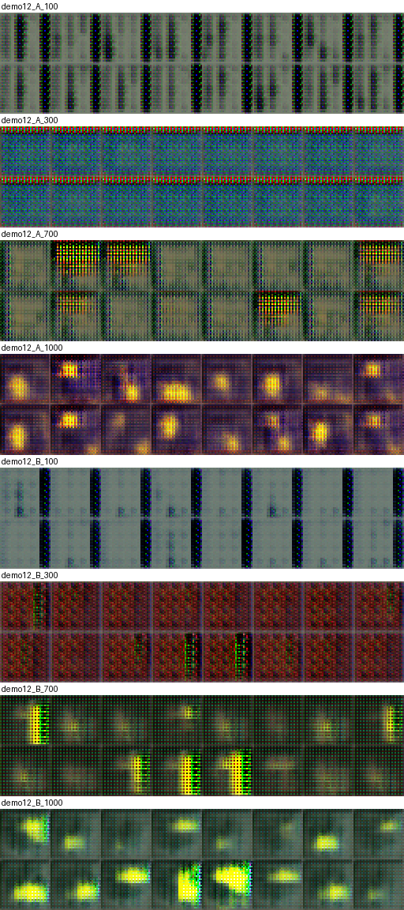

| Параметр | Содержание |
|---|---|
| Продолжительность | 2 академических часа (аудиторная работа); оформление отчёта — самостоятельно |
| Форма работы | индивидуально; вариант назначается по номеру в журнале группы (варианты 1–30) |
| Связь | лекция 7 (разделы 3–5: режимы отказа и приёмы стабилизации); ЛР 11 (та же GAN, метрики и схема сравнения); ЛР 13 использует те же обученные модели для расчёта FID |
| Индикаторы компетенций | ПК-6.1 (протокол эксперимента, базовый уровень); ПК-11.1 (безопасная и воспроизводимая работа с программными компонентами ИИ, базовый уровень) |
| Контроль | отчёт, таблица метрик, листы образцов «до и после», журнал оценок дискриминатора, устная защита |
| Программное обеспечение | среда Engee (проверено 20.09.2026: версия 26.8.2-H3, Python 3.11 из `/user/.user_venvs/py3.11`, PyTorch 2.4.1 на процессоре); внешние библиотеки, кроме PyTorch и NumPy, не нужны |
| Данные и лицензии | синтетические сцены 32×32 из `lab07_lib.py` (ЛР 7) порождаются кодом, внешние данные и права на них не требуются |

# 1. Цель и результаты

**Цель.** Воспроизвести режим, в котором обучение GAN идёт плохо, диагностировать его по журналу оценок дискриминатора и по метрикам, применить один приём стабилизации и измерить на серии seed, помогло ли это.

**Результаты.** После работы студент:

1. воспроизводит «неисправный» режим обучения (сильный дискриминатор, слишком высокая скорость, перекос шагов, малый набор данных, насыщающая потеря) и подтверждает отказ измерением, а не впечатлением;
2. диагностирует отказ по средней оценке дискриминатора на реальных и поддельных изображениях, по образцам и по метрикам правдоподобия и охвата;
3. применяет один из шести приёмов (сглаживание меток, шум на входе дискриминатора, спектральная нормализация, WGAN-GP, два масштаба времени, dropout в дискриминаторе) и записывает «до и после»;
4. отличает приём, который помог, от приёма, чей эффект не превышает разброс между seed, и от приёма, который навредил;
5. формулирует вывод, ограниченный проверенным режимом: приём подбирается под отказ.

# 2. Теоретический минимум

## 2.1. Отказ, диагностика, приём

Отказ обучения GAN проявляется как одно из четырёх явлений (лекция 7, раздел 4): исчезающие градиенты, коллапс мод, нестабильность, переобучение дискриминатора. Потери двух сетей их не различают, поэтому диагностика опирается на три источника: (1) **средняя оценка $D$** на реальных и на поддельных пакетах (при равновесии обе около 0,5; если на поддельных около нуля, дискриминатор побеждает); (2) **образцы** на равных шагах; (3) **метрики** правдоподобия (`nn_psnr`), охвата (`coverage`) и разнообразия (`diversity`) на 1024 тестовых сценах (определения — ЛР 11, раздел 2.3).

Приём стабилизации — вмешательство в конструкцию или в обучение, которое должно вернуть равновесие. Универсального приёма нет: каждый действует на определённую причину, и эффект нужно проверять на серии seed (лекция 7, раздел 5).

## 2.2. Пять «неисправных» режимов (контекст варианта)

Режим A — базовая GAN из ЛР 11 (2.2 в ЛР 11) с одним нарушением; шаги обучения — 1000 (меньше, чем в ЛР 11: отказ проявляется раньше).

| № | Набор | «Неисправность» режима A | Ожидаемое проявление |
|---:|---|---|---|
| 1 | диск | слишком высокая скорость обучения обеих сетей ($2\cdot10^{-3}$ вместо $2\cdot10^{-4}$) и $\beta_1=0{,}9$ | дискриминатор быстро побеждает, образцы размытые, охват падает |
| 2 | диск | сильный дискриминатор: скорость $D$ $2\cdot10^{-3}$ при скорости $G$ $2\cdot10^{-4}$ | падение разнообразия и охвата |
| 3 | диск с шумом | исходная минимаксная потеря генератора при сильном $D$ | исчезающий градиент: образцы не улучшаются |
| 4 | диск и прямоугольник | пять шагов $D$ на шаг $G$ и скорость $D$ $10^{-3}$ | коллапс мод: падает охват, разнообразие |
| 5 | два диска | 256 обучающих изображений, три шага $D$ на шаг $G$, скорость $D$ $10^{-3}$ | переобучение $D$: падает охват |

Конкретные значения для каждого режима — в таблице `CONTEXTS` файла `lab12_lib.py`; они подобраны разведочными запусками (одно обучение на режим, seed 101), после которых режим A измерялся на пяти seed (раздел 6.3 и материалы преподавателя).

## 2.3. Шесть приёмов (фактор)

| № | Приём (режим B = режим A + приём) | Реализация в `lab12_lib.py` | Против чего действует |
|---:|---|---|---|
| 1 | сглаживание меток | целевое значение для реальных изображений 0,9 вместо 1 (Salimans и др., arXiv:1606.03498) | излишняя уверенность $D$ |
| 2 | шум на входе $D$ | к реальным и поддельным изображениям добавляется гауссов шум $\sigma=0{,}1$, линейно убывающий до нуля (Sønderby и др., arXiv:1610.04490) | пересечение носителей распределений, насыщение |
| 3 | спектральная нормализация $D$ | `torch.nn.utils.spectral_norm` для всех слоёв $D$ (Miyato и др., arXiv:1802.05957) | слишком «резкий» $D$ |
| 4 | WGAN-GP | критик без сигмоиды, штраф за градиент с весом 10, два шага критика на шаг $G$, скорости $10^{-4}$, $\beta=(0;0{,}9)$ (Arjovsky и др., arXiv:1701.07875; Gulrajani и др., arXiv:1704.00028) | насыщение и потеря градиента; заменяет весь рецепт обучения |
| 5 | два масштаба времени (TTUR) | скорость $G$ $4\cdot10^{-4}$, скорость $D$ $10^{-4}$, один шаг $D$ (Heusel и др., arXiv:1706.08500) | перекос в пользу $D$ |
| 6 | dropout в $D$ | отключение 30 % нейронов после каждого слоя $D$ | запоминание $D$ обучающих изображений |

Приёмы 4 и 5 заменяют скорости и число шагов режима A целиком (это часть рецепта), остальные добавляются к режиму A без изменения его неисправности.

## 2.4. Схема сравнения

Режим A и режим B обучаются на seed 101…105; метрики, разность $\Delta$, разброс $s$ режима A по seed, отношение $\lvert\Delta\rvert/s$ и признак $\lvert\Delta\rvert>2s$ — как в ЛР 11 (2.4). Допуск на практическую пользу записывается до запуска (в образце: `nn_psnr` — 0,5 дБ; `coverage` — 0,10; `diversity` — 0,05). Приём считается **помогшим**, если по главной метрике (охват или правдоподобие — той, что нарушена в режиме A) $\lvert\Delta\rvert>2s$ и разность в нужную сторону превышает допуск; **навредившим** — если разность в обратную сторону превышает $2s$ и допуск; во всех остальных случаях записывается «эффект не найден при пяти seed».

# 3. Постановка задачи

**Объект.** Пять «неисправных» режимов и шесть приёмов. Вариант $n$ = 1…30 задаёт режим $c=\lceil n/6\rceil$ (таблица 2.2) и приём $k=((n-1)\bmod 6)+1$ (таблица 2.3).

**Вход.** Конфигурации A и B из `lab12_lib.py` (`settings`). **Результат.** Таблица метрик с признаком $2s$, листы образцов режимов A и B (seed 101), журнал оценок дискриминатора, вывод «помог / не помог / навредил», паспорт. **Что фиксируется:** набор, число шагов (1000), пакет, seed, версии. **Что варьируется:** один приём. **Гипотезы** записываются до запуска (раздел 6.1).

# 4. Подготовка среды

1. В Engee создайте папку `lr12` и загрузите в неё `lab07_lib.py` (ЛР 7), `lab11_lib.py` (ЛР 11) и `lab12_lib.py`.
2. Убедитесь, что PyTorch установлен (2.4.1); дополнительные библиотеки не нужны.
3. Потоки: библиотека сама вызывает `torch.set_num_threads(4)`; переменная среды `LAB_THREADS` меняет число потоков.
4. Одно обучение занимает 1–3 минуты на 4 потоках (WGAN-GP — примерно вдвое дольше); вариант — 10 обучений, то есть 15–30 минут.
5. Структура проекта: `lr12/` — код; `lr12/samples/` — листы образцов; `lr12/reports/` — отчёт и таблицы; `lr12/journal.md` — журнал.

Ограничения консоли Engee и запуск в фоне — как в ЛР 11 (раздел 4): длинные строки не набираются, файлы загружаются через панель «Файлы» (проверьте суффикс `_1`), после фонового запуска консоль может зависнуть, сеанс может завершиться сам.

# 5. План выполнения

1. **Вариант.** Определите режим $c$ и приём $k$; выпишите конфигурации A и B. Результат: запись в отчёте.
2. **Гипотеза и допуск.** Запишите до запуска, какой отказ ожидаете в режиме A, как его увидите (какая метрика и какая оценка $D$) и поможет ли приём. Результат: раздел отчёта, датированный до запуска.
3. **Проверка среды.** Команды раздела 4. Результат: версии в журнале.
4. **Диагностика режима A.** Обучите режим A на seed 101, сохраните образцы на шагах 100, 300, 700, 1000; выведите среднюю оценку $D$ на реальных и поддельных (`hist`) и метрики на каждом снимке. Результат: лист образцов, график оценок $D$.
5. **Запуск варианта.** `M = L.variant_summary(n)` (10 обучений). Результат: таблица четырёх метрик.
6. **«До и после».** Сохраните по 32 образца режимов A и B (seed 101) и оцените оценку $D$ режима B тем же способом, что в п. 4. Результат: лист и 3–4 предложения.
7. **Оценка эффекта.** Для главной метрики режима A решите: помог / не помог / навредил (критерий раздела 2.4). Результат: таблица.
8. **Причина.** Объясните, почему приём помог или нет, опираясь на причину отказа (таблица 2.3). Результат: 3–4 предложения.
9. **Паспорт.** Дата, среда, версии, набор, конфигурации A и B, seed, число потоков. Результат: паспорт в отчёте.
10. **Оформление.** Составьте отчёт по структуре раздела 8 и подготовьте ответы на вопросы раздела 9.

**Чек-лист перед сдачей:** отказ подтверждён измерением; менялся один приём; использованы все пять seed; образцы «до и после» просмотрены; вывод «помог» опирается на $\lvert\Delta\rvert>2s$ и допуск, а не на образцы одного seed; указано, что приём проверен только в этом режиме.

# 6. Демонстрационный вариант

Вариант 1: режим 1 (набор «диск», слишком высокая скорость обучения), приём 1 (сглаживание меток).

## 6.1. Мини-задача, гипотеза и допуск

**Мини-задача.** Подтвердить отказ режима A (скорость $2\cdot10^{-3}$, $\beta_1=0{,}9$) по метрикам и оценкам $D$ и проверить, поможет ли сглаживание меток на пяти seed.

**Гипотеза (образец записи; записана до получения результатов расчёта).** (H1) В режиме A дискриминатор побеждает: средняя оценка $D$ на реальных около 0,9, на поддельных около 0,1; `coverage` близок к нулю. (H2) Сглаживание меток ослабляет уверенность $D$, и `coverage` в режиме B вырастет больше чем на $2s$ и на допуск 0,10. (H3) `diversity` не изменится больше допуска 0,05.

## 6.2. Команды

```julia
cd("/user/ii-in-kt/lr12")
run(pipeline(`$PY run_lab.py 12 0`, stdin=devnull, stdout="out12.txt", stderr="err12.txt"), wait=false)
```

`run_lab.py 12 0` считает варианты 1–6 (режим 1); полный прогон всех 30 вариантов — пять процессов `run_lab.py 12 0…4` и сводка `summarize_lab.py 12` (приложение В) — нужен преподавателю. Ваш вариант можно выполнить и напрямую: `import lab12_lib as L; L.variant_summary(n)`.

## 6.3. Результаты

**Условия** (процессор Engee; полный прогон по пяти seed — 20.09–08.10.2026, версии среды 26.8.2-H3 и 26.9.2-H4 при неизменных Python 3.11 и PyTorch 2.4.1; обучение под наблюдением на seed 101 — 20.09.2026; журнал — `demo_journal/engee_run_log.md`). Режим 1: набор «диск», скорость обучения обеих сетей $2\cdot10^{-3}$, $\beta_1=0{,}9$ (режим A); режим B — тот же режим со сглаживанием меток (цель для реальных 0,9). 1000 шагов, пакет 64, seed 101…105. Вызов: `L.variant_summary(1)`.

| Метрика | A | $s$ | B | $\Delta$ | $\lvert\Delta\rvert/s$ | $\lvert\Delta\rvert>2s$ |
|---|---:|---:|---:|---:|---:|:---:|
| `nn_psnr` | 16,44 | 0,97 | 16,64 | +0,20 | 0,2 | нет |
| `coverage` | 0,000 | 0,000 | 0,001 | +0,001 | ∞ | да |
| `diversity` | 0,665 | 0,182 | 0,639 | −0,026 | 0,1 | нет |
| `seconds` | 148,2 | 47,4 | 138,9 | −9,3 | 0,2 | нет |

Значения по seed для главных метрик:

| seed | 101 | 102 | 103 | 104 | 105 |
|---|---:|---:|---:|---:|---:|
| `nn_psnr`, A | 17,80 | 17,02 | 16,20 | 15,42 | 15,75 |
| `nn_psnr`, B | 16,91 | 15,87 | 16,77 | 17,87 | 15,78 |
| B − A | −0,89 | −1,15 | +0,57 | +2,45 | +0,02 |
| `coverage`, A | 0,000 | 0,000 | 0,000 | 0,000 | 0,000 |
| `coverage`, B | 0,000 | 0,000 | 0,000 | 0,004 | 0,000 |
| B − A | +0,000 | +0,000 | +0,000 | +0,004 | +0,000 |

**Воспроизводимость.** Отдельное обучение под наблюдением (`demo_gan.py 12 1`, seed 101, снимки на шагах 100, 300, 700, 1000) дало на шаге 1000 `nn_psnr` A 17,81 и B 16,91 — те же значения, что и в первом столбце таблицы по seed: на процессоре при тех же seed и числе потоков обучение воспроизвелось в пределах выведенных знаков.

**Диагностика и «до и после»** (режимы A и B, seed 101; потери и оценки $D$ — среднее за последние 100 шагов перед снимком):

| Режим | шаг | `nn_psnr` | `coverage` | `diversity` | потеря $G$ | потеря $D$ | $D$ на реальных | $D$ на поддельных |
|---|---:|---:|---:|---:|---:|---:|---:|---:|
| A | 100 | 13,54 | 0,000 | 0,379 | 3,80 | 0,73 | 0,81 | 0,21 |
| A | 300 | 12,12 | 0,000 | 0,144 | 14,78 | 0,22 | 0,95 | 0,07 |
| A | 700 | 15,03 | 0,000 | 0,508 | 4,52 | 0,29 | 0,89 | 0,09 |
| A | 1000 | 17,81 | 0,000 | 0,739 | 7,29 | 0,34 | 0,89 | 0,10 |
| B | 100 | 12,34 | 0,000 | 0,167 | 3,33 | 0,73 | 0,72 | 0,15 |
| B | 300 | 14,75 | 0,000 | 0,262 | 5,16 | 0,59 | 0,78 | 0,08 |
| B | 700 | 15,55 | 0,000 | 0,637 | 5,05 | 0,44 | 0,89 | 0,06 |
| B | 1000 | 16,91 | 0,000 | 0,870 | 5,90 | 0,52 | 0,81 | 0,06 |

В режиме A к шагу 1000 средняя оценка $D$ на реальных 0,89, на поддельных 0,10: дискриминатор уверенно отличает подделки, равновесия (обе около 0,5) нет. Со сглаживанием меток оценка на реальных ниже (0,81) — так и должно быть при цели 0,9, — но на поддельных она не выросла (0,06): дискриминатор по-прежнему побеждает.

Листы образцов (по 16 изображений на шагах 100, 300, 700, 1000; сверху четыре шага режима A, ниже четыре шага режима B; `demo_journal/demo12_sheet.png`):



**Глазами** (наблюдение автора по листу образцов, субъективное). Режим A: на шаге 100 все кадры одинаковы — серый фон с тёмными вертикальными полосами; на шаге 300 — однородный сине-зелёный «шум» сетки транспонированных свёрток, одинаковый во всех кадрах (`diversity` 0,144); на шаге 700 — серые кадры, у части из них сверху жёлтое пятно с крупной сеткой артефактов; на шаге 1000 — жёлтые пятна разной формы и положения на фиолетовом фоне, края размыты, в нескольких кадрах два пятна. Режим B: на шаге 100 — светло-серый фон с одной тёмной полосой, на шаге 300 — одинаковые красно-коричневые кадры с сеткой артефактов; на шаге 700 — тёмно-зелёный фон, диск виден лишь в части кадров и с зелёной «бахромой»; на шаге 1000 — яркие жёлтые пятна на зеленоватом фоне, крупнее и ярче, чем у A, но с «бахромой» и неровными краями. Ни в одном режиме нет ровного диска на градиентном фоне, как в данных; `coverage` на seed 101 равен нулю на всех снимках обоих режимов.

## 6.4. Намеренно введённые ошибки

**Ошибка 1: вывод по одному seed.** На seed 104 сглаживание меток повышает `nn_psnr`: 15,42 → 17,87 (Δ = +2,45) — «приём помог». На seed 102 картина обратная: 17,02 → 15,87 (Δ = −1,15). *Симптом:* разность меняет знак между seed. *Диагностика:* выписать значения по всем seed и сравнить разность средних с разбросом режима A ($s$ = 0,97). *Исправление:* пять seed и признак $2s$ по правилу раздела 2.4.

**Ошибка 2: потери как мера качества и как диагноз.** На шаге 1000 потеря генератора режима B (5,90) ниже, чем режима A (7,29): «со сглаживанием генератор учится лучше». Но `nn_psnr` на этом же seed ниже у B (16,91 против 17,81). Потеря генератора режима A по шагам 100, 300, 700, 1000 скачет: 3,80; 14,78; 4,52; 7,29, а `nn_psnr` за те же шаги меняется так: 13,54; 12,12; 15,03; 17,81. Кроме того, сглаживание меток само меняет масштаб потери $D$ (цель 0,9 не даёт потере опуститься до нуля), поэтому потери режимов A и B вообще нельзя сравнивать напрямую. *Симптом:* порядок режимов по потере противоположен порядку по метрике. *Диагностика:* сопоставить потери с метриками и средними оценками $D$ на равных шагах. *Исправление:* отказ диагностировать по оценкам $D$ на реальных и поддельных, качество — по метрикам на отложенной выборке.

**Ошибка 3: сравнение при разном числе шагов.** Если сравнить режим B после 1000 шагов (`nn_psnr` 16,91) с режимом A после 700 шагов (15,03), получится «сглаживание меток дало +1,88 дБ». При равных 1000 шагах разность −0,90 дБ, то есть знак обратный. *Симптом:* «эффект» исчезает или меняет знак при сопоставлении на одном шаге. *Диагностика:* сверить число шагов в паспортах A и B. *Исправление:* одинаковое число шагов и метрики на одном шаге.

## 6.5. Вывод, ограничения и вопрос для обсуждения

| Гипотеза | Результат | Оценка |
|---|---|---|
| H1: в режиме A $D$ побеждает (на реальных около 0,9, на поддельных около 0,1), `coverage` близок к нулю | seed 101, шаг 1000: 0,89 и 0,10; `coverage` A по пяти seed 0,000 | подтверждена |
| H2: `coverage` вырастет больше $2s$ и допуска 0,10 | Δ = +0,001, $\lvert\Delta\rvert/s$ = ∞ | не подтверждена: эффект не найден при пяти seed |
| H3: `diversity` изменится не больше 0,05 | Δ = −0,026, $\lvert\Delta\rvert/s$ = 0,1 | подтверждена |

**Вывод по варианту 1.** Отказ режима A подтверждён измерением: оценки $D$ на реальных и поддельных далеки от равновесия, охват нулевой. Сглаживание меток по охвату — «эффект не найден», по правдоподобию — «эффект не найден» (Δ `nn_psnr` = +0,20 дБ, $\lvert\Delta\rvert/s$ = 0,2). Причина отказа в этом режиме — слишком большой шаг оптимизации обеих сетей, а сглаживание меток действует на уверенность $D$, а не на шаг; оценка $D$ на поддельных в режиме B осталась около 0,06. В остальных четырёх режимах тот же приём дал (охват / правдоподобие): вариант 7 — эффект не найден / эффект не найден; вариант 13 — эффект не найден / эффект не найден; вариант 19 — эффект не найден / эффект не найден; вариант 25 — эффект не найден / помог. Приём подбирается под причину отказа, и вывод о нём ограничен проверенным режимом.

**Ограничения.** Пять seed и один набор; 1000 шагов; метрики в пикселях; при нулевом охвате у обоих режимов метрика `coverage` не различает их, и главной становится `nn_psnr`; время обучения получено при параллельных процессах. **Вопрос для обсуждения:** какой приём из таблицы 2.3 действует именно на причину отказа режима 1 и что должно измениться в оценках $D$, если он помог?

# 7. Индивидуальные варианты (30)

Номер варианта берётся из журнала группы. Все варианты одной сложности: 10 обучений (5 seed × 2 режима), четыре метрики, листы образцов «до и после».

| № | «Неисправный» режим | Приём | Обязательный эксперимент | Критерий оценки | Ограничение или риск |
|---:|---|---|---|---|---|
| 1 | режим 1: слишком высокая скорость обучения: обе сети 2e-3, β1 = 0,9 | сглаживание меток (цель для реальных 0,9) | Режим A — базовая GAN из ЛР 11 (1000 шагов) с неисправностью: слишком высокая скорость обучения: обе сети 2e-3, β1 = 0,9; набор данных — набор «диск» (жёлтый диск на градиентном фоне; факторы — положение и размер). Подтвердите отказ режима A: оценки дискриминатора на реальных и поддельных, образцы, метрики. Режим B — режим A с одним приёмом: сглаживание меток (цель для реальных 0,9). Пять seed, метрики `nn_psnr`, `coverage`, `diversity`, `seconds`. Проверьте гипотезу: сглаживание меток ослабляет уверенность дискриминатора и повышает охват больше допуска 0,10 и больше 2s. На образцах отдельно оцените: остаётся ли диск ровным, одного размера и на однородном фоне, нет ли «двойников» и пятен. | Отказ режима A подтверждён измерением; гипотеза и допуск записаны до запуска; применён один приём; вывод «помог» опирается на |Δ| > 2s и допуск; указано, что приём проверен только в этом режиме. | Синтетические сцены не содержат персональных данных и прав третьих лиц. Сглаживание меток не действует на причину «слишком высокая скорость»: возможен нулевой эффект. |
| 2 | режим 1: слишком высокая скорость обучения: обе сети 2e-3, β1 = 0,9 | шум на входе дискриминатора (σ = 0,1, убывающий) | Режим A — базовая GAN из ЛР 11 (1000 шагов) с неисправностью: слишком высокая скорость обучения: обе сети 2e-3, β1 = 0,9; набор данных — набор «диск» (жёлтый диск на градиентном фоне; факторы — положение и размер). Подтвердите отказ режима A: оценки дискриминатора на реальных и поддельных, образцы, метрики. Режим B — режим A с одним приёмом: шум на входе дискриминатора (σ = 0,1, убывающий). Пять seed, метрики `nn_psnr`, `coverage`, `diversity`, `seconds`. Проверьте гипотезу: убывающий шум на входе дискриминатора перекрывает носители распределений и уменьшает насыщение; оцените охват и правдоподобие. На образцах отдельно оцените: остаётся ли диск ровным, одного размера и на однородном фоне, нет ли «двойников» и пятен. | Отказ режима A подтверждён измерением; гипотеза и допуск записаны до запуска; применён один приём; вывод «помог» опирается на |Δ| > 2s и допуск; указано, что приём проверен только в этом режиме. | Синтетические сцены не содержат персональных данных и прав третьих лиц. Уровень шума подобран для этих данных; для других изображений он иной. |
| 3 | режим 1: слишком высокая скорость обучения: обе сети 2e-3, β1 = 0,9 | спектральная нормализация дискриминатора | Режим A — базовая GAN из ЛР 11 (1000 шагов) с неисправностью: слишком высокая скорость обучения: обе сети 2e-3, β1 = 0,9; набор данных — набор «диск» (жёлтый диск на градиентном фоне; факторы — положение и размер). Подтвердите отказ режима A: оценки дискриминатора на реальных и поддельных, образцы, метрики. Режим B — режим A с одним приёмом: спектральная нормализация дискриминатора. Пять seed, метрики `nn_psnr`, `coverage`, `diversity`, `seconds`. Проверьте гипотезу: спектральная нормализация удерживает дискриминатор от чрезмерной резкости; оцените охват и оценки дискриминатора. На образцах отдельно оцените: остаётся ли диск ровным, одного размера и на однородном фоне, нет ли «двойников» и пятен. | Отказ режима A подтверждён измерением; гипотеза и допуск записаны до запуска; применён один приём; вывод «помог» опирается на |Δ| > 2s и допуск; указано, что приём проверен только в этом режиме. | Синтетические сцены не содержат персональных данных и прав третьих лиц. Спектральная нормализация замедляет обучение: сообщайте `seconds` отдельно. |
| 4 | режим 1: слишком высокая скорость обучения: обе сети 2e-3, β1 = 0,9 | WGAN-GP (критик со штрафом, два шага критика, скорости 1e-4) | Режим A — базовая GAN из ЛР 11 (1000 шагов) с неисправностью: слишком высокая скорость обучения: обе сети 2e-3, β1 = 0,9; набор данных — набор «диск» (жёлтый диск на градиентном фоне; факторы — положение и размер). Подтвердите отказ режима A: оценки дискриминатора на реальных и поддельных, образцы, метрики. Режим B — режим A с одним приёмом: WGAN-GP (критик со штрафом, два шага критика, скорости 1e-4). Пять seed, метрики `nn_psnr`, `coverage`, `diversity`, `seconds`. Проверьте гипотезу: WGAN-GP как рецепт (критик, штраф, свои скорости) устраняет отказ режима A; учтите, что он заменяет скорости и потерю целиком. На образцах отдельно оцените: остаётся ли диск ровным, одного размера и на однородном фоне, нет ли «двойников» и пятен. | Отказ режима A подтверждён измерением; гипотеза и допуск записаны до запуска; применён один приём; вывод «помог» опирается на |Δ| > 2s и допуск; указано, что приём проверен только в этом режиме. | Синтетические сцены не содержат персональных данных и прав третьих лиц. WGAN-GP дороже по времени (штраф за градиент, два шага критика); сравнение с режимом A идёт при том же числе шагов генератора, но при большем числе вычислений. |
| 5 | режим 1: слишком высокая скорость обучения: обе сети 2e-3, β1 = 0,9 | два масштаба времени (скорость G 4e-4, D 1e-4) | Режим A — базовая GAN из ЛР 11 (1000 шагов) с неисправностью: слишком высокая скорость обучения: обе сети 2e-3, β1 = 0,9; набор данных — набор «диск» (жёлтый диск на градиентном фоне; факторы — положение и размер). Подтвердите отказ режима A: оценки дискриминатора на реальных и поддельных, образцы, метрики. Режим B — режим A с одним приёмом: два масштаба времени (скорость G 4e-4, D 1e-4). Пять seed, метрики `nn_psnr`, `coverage`, `diversity`, `seconds`. Проверьте гипотезу: замедление дискриминатора относительно генератора возвращает равновесие; оцените охват, правдоподобие и оценки дискриминатора. На образцах отдельно оцените: остаётся ли диск ровным, одного размера и на однородном фоне, нет ли «двойников» и пятен. | Отказ режима A подтверждён измерением; гипотеза и допуск записаны до запуска; применён один приём; вывод «помог» опирается на |Δ| > 2s и допуск; указано, что приём проверен только в этом режиме. | Синтетические сцены не содержат персональных данных и прав третьих лиц. Приём заменяет скорости режима A (в том числе «неисправные»), поэтому вывод о нём — вывод о замене рецепта. |
| 6 | режим 1: слишком высокая скорость обучения: обе сети 2e-3, β1 = 0,9 | dropout 30 % в дискриминаторе | Режим A — базовая GAN из ЛР 11 (1000 шагов) с неисправностью: слишком высокая скорость обучения: обе сети 2e-3, β1 = 0,9; набор данных — набор «диск» (жёлтый диск на градиентном фоне; факторы — положение и размер). Подтвердите отказ режима A: оценки дискриминатора на реальных и поддельных, образцы, метрики. Режим B — режим A с одним приёмом: dropout 30 % в дискриминаторе. Пять seed, метрики `nn_psnr`, `coverage`, `diversity`, `seconds`. Проверьте гипотезу: dropout в дискриминаторе ослабляет запоминание и повышает охват в режимах с малым набором данных и с сильным дискриминатором. На образцах отдельно оцените: остаётся ли диск ровным, одного размера и на однородном фоне, нет ли «двойников» и пятен. | Отказ режима A подтверждён измерением; гипотеза и допуск записаны до запуска; применён один приём; вывод «помог» опирается на |Δ| > 2s и допуск; указано, что приём проверен только в этом режиме. | Синтетические сцены не содержат персональных данных и прав третьих лиц. Dropout в дискриминаторе увеличивает шум обучения: смотрите разброс между seed. |
| 7 | режим 2: сильный дискриминатор: скорость обучения D в 10 раз выше, чем в ЛР 11 | сглаживание меток (цель для реальных 0,9) | Режим A — базовая GAN из ЛР 11 (1000 шагов) с неисправностью: сильный дискриминатор: скорость обучения D в 10 раз выше, чем в ЛР 11; набор данных — набор «диск» (жёлтый диск на градиентном фоне; факторы — положение и размер). Подтвердите отказ режима A: оценки дискриминатора на реальных и поддельных, образцы, метрики. Режим B — режим A с одним приёмом: сглаживание меток (цель для реальных 0,9). Пять seed, метрики `nn_psnr`, `coverage`, `diversity`, `seconds`. Проверьте гипотезу: сглаживание меток ослабляет уверенность дискриминатора и повышает охват больше допуска 0,10 и больше 2s. На образцах отдельно оцените: остаётся ли диск ровным, одного размера и на однородном фоне, нет ли «двойников» и пятен. | Отказ режима A подтверждён измерением; гипотеза и допуск записаны до запуска; применён один приём; вывод «помог» опирается на |Δ| > 2s и допуск; указано, что приём проверен только в этом режиме. | Синтетические сцены не содержат персональных данных и прав третьих лиц. Сглаживание меток не действует на причину «слишком высокая скорость»: возможен нулевой эффект. |
| 8 | режим 2: сильный дискриминатор: скорость обучения D в 10 раз выше, чем в ЛР 11 | шум на входе дискриминатора (σ = 0,1, убывающий) | Режим A — базовая GAN из ЛР 11 (1000 шагов) с неисправностью: сильный дискриминатор: скорость обучения D в 10 раз выше, чем в ЛР 11; набор данных — набор «диск» (жёлтый диск на градиентном фоне; факторы — положение и размер). Подтвердите отказ режима A: оценки дискриминатора на реальных и поддельных, образцы, метрики. Режим B — режим A с одним приёмом: шум на входе дискриминатора (σ = 0,1, убывающий). Пять seed, метрики `nn_psnr`, `coverage`, `diversity`, `seconds`. Проверьте гипотезу: убывающий шум на входе дискриминатора перекрывает носители распределений и уменьшает насыщение; оцените охват и правдоподобие. На образцах отдельно оцените: остаётся ли диск ровным, одного размера и на однородном фоне, нет ли «двойников» и пятен. | Отказ режима A подтверждён измерением; гипотеза и допуск записаны до запуска; применён один приём; вывод «помог» опирается на |Δ| > 2s и допуск; указано, что приём проверен только в этом режиме. | Синтетические сцены не содержат персональных данных и прав третьих лиц. Уровень шума подобран для этих данных; для других изображений он иной. |
| 9 | режим 2: сильный дискриминатор: скорость обучения D в 10 раз выше, чем в ЛР 11 | спектральная нормализация дискриминатора | Режим A — базовая GAN из ЛР 11 (1000 шагов) с неисправностью: сильный дискриминатор: скорость обучения D в 10 раз выше, чем в ЛР 11; набор данных — набор «диск» (жёлтый диск на градиентном фоне; факторы — положение и размер). Подтвердите отказ режима A: оценки дискриминатора на реальных и поддельных, образцы, метрики. Режим B — режим A с одним приёмом: спектральная нормализация дискриминатора. Пять seed, метрики `nn_psnr`, `coverage`, `diversity`, `seconds`. Проверьте гипотезу: спектральная нормализация удерживает дискриминатор от чрезмерной резкости; оцените охват и оценки дискриминатора. На образцах отдельно оцените: остаётся ли диск ровным, одного размера и на однородном фоне, нет ли «двойников» и пятен. | Отказ режима A подтверждён измерением; гипотеза и допуск записаны до запуска; применён один приём; вывод «помог» опирается на |Δ| > 2s и допуск; указано, что приём проверен только в этом режиме. | Синтетические сцены не содержат персональных данных и прав третьих лиц. Спектральная нормализация замедляет обучение: сообщайте `seconds` отдельно. |
| 10 | режим 2: сильный дискриминатор: скорость обучения D в 10 раз выше, чем в ЛР 11 | WGAN-GP (критик со штрафом, два шага критика, скорости 1e-4) | Режим A — базовая GAN из ЛР 11 (1000 шагов) с неисправностью: сильный дискриминатор: скорость обучения D в 10 раз выше, чем в ЛР 11; набор данных — набор «диск» (жёлтый диск на градиентном фоне; факторы — положение и размер). Подтвердите отказ режима A: оценки дискриминатора на реальных и поддельных, образцы, метрики. Режим B — режим A с одним приёмом: WGAN-GP (критик со штрафом, два шага критика, скорости 1e-4). Пять seed, метрики `nn_psnr`, `coverage`, `diversity`, `seconds`. Проверьте гипотезу: WGAN-GP как рецепт (критик, штраф, свои скорости) устраняет отказ режима A; учтите, что он заменяет скорости и потерю целиком. На образцах отдельно оцените: остаётся ли диск ровным, одного размера и на однородном фоне, нет ли «двойников» и пятен. | Отказ режима A подтверждён измерением; гипотеза и допуск записаны до запуска; применён один приём; вывод «помог» опирается на |Δ| > 2s и допуск; указано, что приём проверен только в этом режиме. | Синтетические сцены не содержат персональных данных и прав третьих лиц. WGAN-GP дороже по времени (штраф за градиент, два шага критика); сравнение с режимом A идёт при том же числе шагов генератора, но при большем числе вычислений. |
| 11 | режим 2: сильный дискриминатор: скорость обучения D в 10 раз выше, чем в ЛР 11 | два масштаба времени (скорость G 4e-4, D 1e-4) | Режим A — базовая GAN из ЛР 11 (1000 шагов) с неисправностью: сильный дискриминатор: скорость обучения D в 10 раз выше, чем в ЛР 11; набор данных — набор «диск» (жёлтый диск на градиентном фоне; факторы — положение и размер). Подтвердите отказ режима A: оценки дискриминатора на реальных и поддельных, образцы, метрики. Режим B — режим A с одним приёмом: два масштаба времени (скорость G 4e-4, D 1e-4). Пять seed, метрики `nn_psnr`, `coverage`, `diversity`, `seconds`. Проверьте гипотезу: замедление дискриминатора относительно генератора возвращает равновесие; оцените охват, правдоподобие и оценки дискриминатора. На образцах отдельно оцените: остаётся ли диск ровным, одного размера и на однородном фоне, нет ли «двойников» и пятен. | Отказ режима A подтверждён измерением; гипотеза и допуск записаны до запуска; применён один приём; вывод «помог» опирается на |Δ| > 2s и допуск; указано, что приём проверен только в этом режиме. | Синтетические сцены не содержат персональных данных и прав третьих лиц. Приём заменяет скорости режима A (в том числе «неисправные»), поэтому вывод о нём — вывод о замене рецепта. |
| 12 | режим 2: сильный дискриминатор: скорость обучения D в 10 раз выше, чем в ЛР 11 | dropout 30 % в дискриминаторе | Режим A — базовая GAN из ЛР 11 (1000 шагов) с неисправностью: сильный дискриминатор: скорость обучения D в 10 раз выше, чем в ЛР 11; набор данных — набор «диск» (жёлтый диск на градиентном фоне; факторы — положение и размер). Подтвердите отказ режима A: оценки дискриминатора на реальных и поддельных, образцы, метрики. Режим B — режим A с одним приёмом: dropout 30 % в дискриминаторе. Пять seed, метрики `nn_psnr`, `coverage`, `diversity`, `seconds`. Проверьте гипотезу: dropout в дискриминаторе ослабляет запоминание и повышает охват в режимах с малым набором данных и с сильным дискриминатором. На образцах отдельно оцените: остаётся ли диск ровным, одного размера и на однородном фоне, нет ли «двойников» и пятен. | Отказ режима A подтверждён измерением; гипотеза и допуск записаны до запуска; применён один приём; вывод «помог» опирается на |Δ| > 2s и допуск; указано, что приём проверен только в этом режиме. | Синтетические сцены не содержат персональных данных и прав третьих лиц. Dropout в дискриминаторе увеличивает шум обучения: смотрите разброс между seed. |
| 13 | режим 3: минимаксная (насыщающая) потеря генератора при сильном D | сглаживание меток (цель для реальных 0,9) | Режим A — базовая GAN из ЛР 11 (1000 шагов) с неисправностью: минимаксная (насыщающая) потеря генератора при сильном D; набор данных — набор «диск с шумом» (гауссов шум σ = 0,05 на изображении). Подтвердите отказ режима A: оценки дискриминатора на реальных и поддельных, образцы, метрики. Режим B — режим A с одним приёмом: сглаживание меток (цель для реальных 0,9). Пять seed, метрики `nn_psnr`, `coverage`, `diversity`, `seconds`. Проверьте гипотезу: сглаживание меток ослабляет уверенность дискриминатора и повышает охват больше допуска 0,10 и больше 2s. На образцах отдельно оцените: отличается ли шум на образцах от шума данных и не принят ли он за деталь. | Отказ режима A подтверждён измерением; гипотеза и допуск записаны до запуска; применён один приём; вывод «помог» опирается на |Δ| > 2s и допуск; указано, что приём проверен только в этом режиме. | Синтетические сцены не содержат персональных данных и прав третьих лиц. Сглаживание меток не действует на причину «слишком высокая скорость»: возможен нулевой эффект. |
| 14 | режим 3: минимаксная (насыщающая) потеря генератора при сильном D | шум на входе дискриминатора (σ = 0,1, убывающий) | Режим A — базовая GAN из ЛР 11 (1000 шагов) с неисправностью: минимаксная (насыщающая) потеря генератора при сильном D; набор данных — набор «диск с шумом» (гауссов шум σ = 0,05 на изображении). Подтвердите отказ режима A: оценки дискриминатора на реальных и поддельных, образцы, метрики. Режим B — режим A с одним приёмом: шум на входе дискриминатора (σ = 0,1, убывающий). Пять seed, метрики `nn_psnr`, `coverage`, `diversity`, `seconds`. Проверьте гипотезу: убывающий шум на входе дискриминатора перекрывает носители распределений и уменьшает насыщение; оцените охват и правдоподобие. На образцах отдельно оцените: отличается ли шум на образцах от шума данных и не принят ли он за деталь. | Отказ режима A подтверждён измерением; гипотеза и допуск записаны до запуска; применён один приём; вывод «помог» опирается на |Δ| > 2s и допуск; указано, что приём проверен только в этом режиме. | Синтетические сцены не содержат персональных данных и прав третьих лиц. Уровень шума подобран для этих данных; для других изображений он иной. |
| 15 | режим 3: минимаксная (насыщающая) потеря генератора при сильном D | спектральная нормализация дискриминатора | Режим A — базовая GAN из ЛР 11 (1000 шагов) с неисправностью: минимаксная (насыщающая) потеря генератора при сильном D; набор данных — набор «диск с шумом» (гауссов шум σ = 0,05 на изображении). Подтвердите отказ режима A: оценки дискриминатора на реальных и поддельных, образцы, метрики. Режим B — режим A с одним приёмом: спектральная нормализация дискриминатора. Пять seed, метрики `nn_psnr`, `coverage`, `diversity`, `seconds`. Проверьте гипотезу: спектральная нормализация удерживает дискриминатор от чрезмерной резкости; оцените охват и оценки дискриминатора. На образцах отдельно оцените: отличается ли шум на образцах от шума данных и не принят ли он за деталь. | Отказ режима A подтверждён измерением; гипотеза и допуск записаны до запуска; применён один приём; вывод «помог» опирается на |Δ| > 2s и допуск; указано, что приём проверен только в этом режиме. | Синтетические сцены не содержат персональных данных и прав третьих лиц. Спектральная нормализация замедляет обучение: сообщайте `seconds` отдельно. |
| 16 | режим 3: минимаксная (насыщающая) потеря генератора при сильном D | WGAN-GP (критик со штрафом, два шага критика, скорости 1e-4) | Режим A — базовая GAN из ЛР 11 (1000 шагов) с неисправностью: минимаксная (насыщающая) потеря генератора при сильном D; набор данных — набор «диск с шумом» (гауссов шум σ = 0,05 на изображении). Подтвердите отказ режима A: оценки дискриминатора на реальных и поддельных, образцы, метрики. Режим B — режим A с одним приёмом: WGAN-GP (критик со штрафом, два шага критика, скорости 1e-4). Пять seed, метрики `nn_psnr`, `coverage`, `diversity`, `seconds`. Проверьте гипотезу: WGAN-GP как рецепт (критик, штраф, свои скорости) устраняет отказ режима A; учтите, что он заменяет скорости и потерю целиком. На образцах отдельно оцените: отличается ли шум на образцах от шума данных и не принят ли он за деталь. | Отказ режима A подтверждён измерением; гипотеза и допуск записаны до запуска; применён один приём; вывод «помог» опирается на |Δ| > 2s и допуск; указано, что приём проверен только в этом режиме. | Синтетические сцены не содержат персональных данных и прав третьих лиц. WGAN-GP дороже по времени (штраф за градиент, два шага критика); сравнение с режимом A идёт при том же числе шагов генератора, но при большем числе вычислений. |
| 17 | режим 3: минимаксная (насыщающая) потеря генератора при сильном D | два масштаба времени (скорость G 4e-4, D 1e-4) | Режим A — базовая GAN из ЛР 11 (1000 шагов) с неисправностью: минимаксная (насыщающая) потеря генератора при сильном D; набор данных — набор «диск с шумом» (гауссов шум σ = 0,05 на изображении). Подтвердите отказ режима A: оценки дискриминатора на реальных и поддельных, образцы, метрики. Режим B — режим A с одним приёмом: два масштаба времени (скорость G 4e-4, D 1e-4). Пять seed, метрики `nn_psnr`, `coverage`, `diversity`, `seconds`. Проверьте гипотезу: замедление дискриминатора относительно генератора возвращает равновесие; оцените охват, правдоподобие и оценки дискриминатора. На образцах отдельно оцените: отличается ли шум на образцах от шума данных и не принят ли он за деталь. | Отказ режима A подтверждён измерением; гипотеза и допуск записаны до запуска; применён один приём; вывод «помог» опирается на |Δ| > 2s и допуск; указано, что приём проверен только в этом режиме. | Синтетические сцены не содержат персональных данных и прав третьих лиц. Приём заменяет скорости режима A (в том числе «неисправные»), поэтому вывод о нём — вывод о замене рецепта. |
| 18 | режим 3: минимаксная (насыщающая) потеря генератора при сильном D | dropout 30 % в дискриминаторе | Режим A — базовая GAN из ЛР 11 (1000 шагов) с неисправностью: минимаксная (насыщающая) потеря генератора при сильном D; набор данных — набор «диск с шумом» (гауссов шум σ = 0,05 на изображении). Подтвердите отказ режима A: оценки дискриминатора на реальных и поддельных, образцы, метрики. Режим B — режим A с одним приёмом: dropout 30 % в дискриминаторе. Пять seed, метрики `nn_psnr`, `coverage`, `diversity`, `seconds`. Проверьте гипотезу: dropout в дискриминаторе ослабляет запоминание и повышает охват в режимах с малым набором данных и с сильным дискриминатором. На образцах отдельно оцените: отличается ли шум на образцах от шума данных и не принят ли он за деталь. | Отказ режима A подтверждён измерением; гипотеза и допуск записаны до запуска; применён один приём; вывод «помог» опирается на |Δ| > 2s и допуск; указано, что приём проверен только в этом режиме. | Синтетические сцены не содержат персональных данных и прав третьих лиц. Dropout в дискриминаторе увеличивает шум обучения: смотрите разброс между seed. |
| 19 | режим 4: перекос шагов: пять шагов D на один шаг G и скорость D 1e-3 | сглаживание меток (цель для реальных 0,9) | Режим A — базовая GAN из ЛР 11 (1000 шагов) с неисправностью: перекос шагов: пять шагов D на один шаг G и скорость D 1e-3; набор данных — набор «диск и прямоугольник» (плюс зелёный прямоугольник; четыре фактора). Подтвердите отказ режима A: оценки дискриминатора на реальных и поддельных, образцы, метрики. Режим B — режим A с одним приёмом: сглаживание меток (цель для реальных 0,9). Пять seed, метрики `nn_psnr`, `coverage`, `diversity`, `seconds`. Проверьте гипотезу: сглаживание меток ослабляет уверенность дискриминатора и повышает охват больше допуска 0,10 и больше 2s. На образцах отдельно оцените: присутствует ли прямоугольник в нижней части кадра и не сливается ли он с фоном. | Отказ режима A подтверждён измерением; гипотеза и допуск записаны до запуска; применён один приём; вывод «помог» опирается на |Δ| > 2s и допуск; указано, что приём проверен только в этом режиме. | Синтетические сцены не содержат персональных данных и прав третьих лиц. Сглаживание меток не действует на причину «слишком высокая скорость»: возможен нулевой эффект. |
| 20 | режим 4: перекос шагов: пять шагов D на один шаг G и скорость D 1e-3 | шум на входе дискриминатора (σ = 0,1, убывающий) | Режим A — базовая GAN из ЛР 11 (1000 шагов) с неисправностью: перекос шагов: пять шагов D на один шаг G и скорость D 1e-3; набор данных — набор «диск и прямоугольник» (плюс зелёный прямоугольник; четыре фактора). Подтвердите отказ режима A: оценки дискриминатора на реальных и поддельных, образцы, метрики. Режим B — режим A с одним приёмом: шум на входе дискриминатора (σ = 0,1, убывающий). Пять seed, метрики `nn_psnr`, `coverage`, `diversity`, `seconds`. Проверьте гипотезу: убывающий шум на входе дискриминатора перекрывает носители распределений и уменьшает насыщение; оцените охват и правдоподобие. На образцах отдельно оцените: присутствует ли прямоугольник в нижней части кадра и не сливается ли он с фоном. | Отказ режима A подтверждён измерением; гипотеза и допуск записаны до запуска; применён один приём; вывод «помог» опирается на |Δ| > 2s и допуск; указано, что приём проверен только в этом режиме. | Синтетические сцены не содержат персональных данных и прав третьих лиц. Уровень шума подобран для этих данных; для других изображений он иной. |
| 21 | режим 4: перекос шагов: пять шагов D на один шаг G и скорость D 1e-3 | спектральная нормализация дискриминатора | Режим A — базовая GAN из ЛР 11 (1000 шагов) с неисправностью: перекос шагов: пять шагов D на один шаг G и скорость D 1e-3; набор данных — набор «диск и прямоугольник» (плюс зелёный прямоугольник; четыре фактора). Подтвердите отказ режима A: оценки дискриминатора на реальных и поддельных, образцы, метрики. Режим B — режим A с одним приёмом: спектральная нормализация дискриминатора. Пять seed, метрики `nn_psnr`, `coverage`, `diversity`, `seconds`. Проверьте гипотезу: спектральная нормализация удерживает дискриминатор от чрезмерной резкости; оцените охват и оценки дискриминатора. На образцах отдельно оцените: присутствует ли прямоугольник в нижней части кадра и не сливается ли он с фоном. | Отказ режима A подтверждён измерением; гипотеза и допуск записаны до запуска; применён один приём; вывод «помог» опирается на |Δ| > 2s и допуск; указано, что приём проверен только в этом режиме. | Синтетические сцены не содержат персональных данных и прав третьих лиц. Спектральная нормализация замедляет обучение: сообщайте `seconds` отдельно. |
| 22 | режим 4: перекос шагов: пять шагов D на один шаг G и скорость D 1e-3 | WGAN-GP (критик со штрафом, два шага критика, скорости 1e-4) | Режим A — базовая GAN из ЛР 11 (1000 шагов) с неисправностью: перекос шагов: пять шагов D на один шаг G и скорость D 1e-3; набор данных — набор «диск и прямоугольник» (плюс зелёный прямоугольник; четыре фактора). Подтвердите отказ режима A: оценки дискриминатора на реальных и поддельных, образцы, метрики. Режим B — режим A с одним приёмом: WGAN-GP (критик со штрафом, два шага критика, скорости 1e-4). Пять seed, метрики `nn_psnr`, `coverage`, `diversity`, `seconds`. Проверьте гипотезу: WGAN-GP как рецепт (критик, штраф, свои скорости) устраняет отказ режима A; учтите, что он заменяет скорости и потерю целиком. На образцах отдельно оцените: присутствует ли прямоугольник в нижней части кадра и не сливается ли он с фоном. | Отказ режима A подтверждён измерением; гипотеза и допуск записаны до запуска; применён один приём; вывод «помог» опирается на |Δ| > 2s и допуск; указано, что приём проверен только в этом режиме. | Синтетические сцены не содержат персональных данных и прав третьих лиц. WGAN-GP дороже по времени (штраф за градиент, два шага критика); сравнение с режимом A идёт при том же числе шагов генератора, но при большем числе вычислений. |
| 23 | режим 4: перекос шагов: пять шагов D на один шаг G и скорость D 1e-3 | два масштаба времени (скорость G 4e-4, D 1e-4) | Режим A — базовая GAN из ЛР 11 (1000 шагов) с неисправностью: перекос шагов: пять шагов D на один шаг G и скорость D 1e-3; набор данных — набор «диск и прямоугольник» (плюс зелёный прямоугольник; четыре фактора). Подтвердите отказ режима A: оценки дискриминатора на реальных и поддельных, образцы, метрики. Режим B — режим A с одним приёмом: два масштаба времени (скорость G 4e-4, D 1e-4). Пять seed, метрики `nn_psnr`, `coverage`, `diversity`, `seconds`. Проверьте гипотезу: замедление дискриминатора относительно генератора возвращает равновесие; оцените охват, правдоподобие и оценки дискриминатора. На образцах отдельно оцените: присутствует ли прямоугольник в нижней части кадра и не сливается ли он с фоном. | Отказ режима A подтверждён измерением; гипотеза и допуск записаны до запуска; применён один приём; вывод «помог» опирается на |Δ| > 2s и допуск; указано, что приём проверен только в этом режиме. | Синтетические сцены не содержат персональных данных и прав третьих лиц. Приём заменяет скорости режима A (в том числе «неисправные»), поэтому вывод о нём — вывод о замене рецепта. |
| 24 | режим 4: перекос шагов: пять шагов D на один шаг G и скорость D 1e-3 | dropout 30 % в дискриминаторе | Режим A — базовая GAN из ЛР 11 (1000 шагов) с неисправностью: перекос шагов: пять шагов D на один шаг G и скорость D 1e-3; набор данных — набор «диск и прямоугольник» (плюс зелёный прямоугольник; четыре фактора). Подтвердите отказ режима A: оценки дискриминатора на реальных и поддельных, образцы, метрики. Режим B — режим A с одним приёмом: dropout 30 % в дискриминаторе. Пять seed, метрики `nn_psnr`, `coverage`, `diversity`, `seconds`. Проверьте гипотезу: dropout в дискриминаторе ослабляет запоминание и повышает охват в режимах с малым набором данных и с сильным дискриминатором. На образцах отдельно оцените: присутствует ли прямоугольник в нижней части кадра и не сливается ли он с фоном. | Отказ режима A подтверждён измерением; гипотеза и допуск записаны до запуска; применён один приём; вывод «помог» опирается на |Δ| > 2s и допуск; указано, что приём проверен только в этом режиме. | Синтетические сцены не содержат персональных данных и прав третьих лиц. Dropout в дискриминаторе увеличивает шум обучения: смотрите разброс между seed. |
| 25 | режим 5: малый набор данных: 256 изображений, три шага D на шаг G, скорость D 1e-3 | сглаживание меток (цель для реальных 0,9) | Режим A — базовая GAN из ЛР 11 (1000 шагов) с неисправностью: малый набор данных: 256 изображений, три шага D на шаг G, скорость D 1e-3; набор данных — набор «два диска» (жёлтый и розовый диски; четыре фактора). Подтвердите отказ режима A: оценки дискриминатора на реальных и поддельных, образцы, метрики. Режим B — режим A с одним приёмом: сглаживание меток (цель для реальных 0,9). Пять seed, метрики `nn_psnr`, `coverage`, `diversity`, `seconds`. Проверьте гипотезу: сглаживание меток ослабляет уверенность дискриминатора и повышает охват больше допуска 0,10 и больше 2s. На образцах отдельно оцените: различимы ли два диска разных цветов и не пропадает ли один из них. | Отказ режима A подтверждён измерением; гипотеза и допуск записаны до запуска; применён один приём; вывод «помог» опирается на |Δ| > 2s и допуск; указано, что приём проверен только в этом режиме. | Синтетические сцены не содержат персональных данных и прав третьих лиц. Сглаживание меток не действует на причину «слишком высокая скорость»: возможен нулевой эффект. |
| 26 | режим 5: малый набор данных: 256 изображений, три шага D на шаг G, скорость D 1e-3 | шум на входе дискриминатора (σ = 0,1, убывающий) | Режим A — базовая GAN из ЛР 11 (1000 шагов) с неисправностью: малый набор данных: 256 изображений, три шага D на шаг G, скорость D 1e-3; набор данных — набор «два диска» (жёлтый и розовый диски; четыре фактора). Подтвердите отказ режима A: оценки дискриминатора на реальных и поддельных, образцы, метрики. Режим B — режим A с одним приёмом: шум на входе дискриминатора (σ = 0,1, убывающий). Пять seed, метрики `nn_psnr`, `coverage`, `diversity`, `seconds`. Проверьте гипотезу: убывающий шум на входе дискриминатора перекрывает носители распределений и уменьшает насыщение; оцените охват и правдоподобие. На образцах отдельно оцените: различимы ли два диска разных цветов и не пропадает ли один из них. | Отказ режима A подтверждён измерением; гипотеза и допуск записаны до запуска; применён один приём; вывод «помог» опирается на |Δ| > 2s и допуск; указано, что приём проверен только в этом режиме. | Синтетические сцены не содержат персональных данных и прав третьих лиц. Уровень шума подобран для этих данных; для других изображений он иной. |
| 27 | режим 5: малый набор данных: 256 изображений, три шага D на шаг G, скорость D 1e-3 | спектральная нормализация дискриминатора | Режим A — базовая GAN из ЛР 11 (1000 шагов) с неисправностью: малый набор данных: 256 изображений, три шага D на шаг G, скорость D 1e-3; набор данных — набор «два диска» (жёлтый и розовый диски; четыре фактора). Подтвердите отказ режима A: оценки дискриминатора на реальных и поддельных, образцы, метрики. Режим B — режим A с одним приёмом: спектральная нормализация дискриминатора. Пять seed, метрики `nn_psnr`, `coverage`, `diversity`, `seconds`. Проверьте гипотезу: спектральная нормализация удерживает дискриминатор от чрезмерной резкости; оцените охват и оценки дискриминатора. На образцах отдельно оцените: различимы ли два диска разных цветов и не пропадает ли один из них. | Отказ режима A подтверждён измерением; гипотеза и допуск записаны до запуска; применён один приём; вывод «помог» опирается на |Δ| > 2s и допуск; указано, что приём проверен только в этом режиме. | Синтетические сцены не содержат персональных данных и прав третьих лиц. Спектральная нормализация замедляет обучение: сообщайте `seconds` отдельно. |
| 28 | режим 5: малый набор данных: 256 изображений, три шага D на шаг G, скорость D 1e-3 | WGAN-GP (критик со штрафом, два шага критика, скорости 1e-4) | Режим A — базовая GAN из ЛР 11 (1000 шагов) с неисправностью: малый набор данных: 256 изображений, три шага D на шаг G, скорость D 1e-3; набор данных — набор «два диска» (жёлтый и розовый диски; четыре фактора). Подтвердите отказ режима A: оценки дискриминатора на реальных и поддельных, образцы, метрики. Режим B — режим A с одним приёмом: WGAN-GP (критик со штрафом, два шага критика, скорости 1e-4). Пять seed, метрики `nn_psnr`, `coverage`, `diversity`, `seconds`. Проверьте гипотезу: WGAN-GP как рецепт (критик, штраф, свои скорости) устраняет отказ режима A; учтите, что он заменяет скорости и потерю целиком. На образцах отдельно оцените: различимы ли два диска разных цветов и не пропадает ли один из них. | Отказ режима A подтверждён измерением; гипотеза и допуск записаны до запуска; применён один приём; вывод «помог» опирается на |Δ| > 2s и допуск; указано, что приём проверен только в этом режиме. | Синтетические сцены не содержат персональных данных и прав третьих лиц. WGAN-GP дороже по времени (штраф за градиент, два шага критика); сравнение с режимом A идёт при том же числе шагов генератора, но при большем числе вычислений. |
| 29 | режим 5: малый набор данных: 256 изображений, три шага D на шаг G, скорость D 1e-3 | два масштаба времени (скорость G 4e-4, D 1e-4) | Режим A — базовая GAN из ЛР 11 (1000 шагов) с неисправностью: малый набор данных: 256 изображений, три шага D на шаг G, скорость D 1e-3; набор данных — набор «два диска» (жёлтый и розовый диски; четыре фактора). Подтвердите отказ режима A: оценки дискриминатора на реальных и поддельных, образцы, метрики. Режим B — режим A с одним приёмом: два масштаба времени (скорость G 4e-4, D 1e-4). Пять seed, метрики `nn_psnr`, `coverage`, `diversity`, `seconds`. Проверьте гипотезу: замедление дискриминатора относительно генератора возвращает равновесие; оцените охват, правдоподобие и оценки дискриминатора. На образцах отдельно оцените: различимы ли два диска разных цветов и не пропадает ли один из них. | Отказ режима A подтверждён измерением; гипотеза и допуск записаны до запуска; применён один приём; вывод «помог» опирается на |Δ| > 2s и допуск; указано, что приём проверен только в этом режиме. | Синтетические сцены не содержат персональных данных и прав третьих лиц. Приём заменяет скорости режима A (в том числе «неисправные»), поэтому вывод о нём — вывод о замене рецепта. |
| 30 | режим 5: малый набор данных: 256 изображений, три шага D на шаг G, скорость D 1e-3 | dropout 30 % в дискриминаторе | Режим A — базовая GAN из ЛР 11 (1000 шагов) с неисправностью: малый набор данных: 256 изображений, три шага D на шаг G, скорость D 1e-3; набор данных — набор «два диска» (жёлтый и розовый диски; четыре фактора). Подтвердите отказ режима A: оценки дискриминатора на реальных и поддельных, образцы, метрики. Режим B — режим A с одним приёмом: dropout 30 % в дискриминаторе. Пять seed, метрики `nn_psnr`, `coverage`, `diversity`, `seconds`. Проверьте гипотезу: dropout в дискриминаторе ослабляет запоминание и повышает охват в режимах с малым набором данных и с сильным дискриминатором. На образцах отдельно оцените: различимы ли два диска разных цветов и не пропадает ли один из них. | Отказ режима A подтверждён измерением; гипотеза и допуск записаны до запуска; применён один приём; вывод «помог» опирается на |Δ| > 2s и допуск; указано, что приём проверен только в этом режиме. | Синтетические сцены не содержат персональных данных и прав третьих лиц. Dropout в дискриминаторе увеличивает шум обучения: смотрите разброс между seed. |

# 8. Отчёт и защита

**Структура отчёта:** 1) титульный лист и номер варианта; 2) цель, постановка, гипотеза и допуск (датированы до запуска); 3) режим A: конфигурация, диагностика отказа; 4) режим B: приём, обоснование; 5) среда: версии, параметры, ресурсы; 6) результаты: таблица метрик, листы «до и после», оценки $D$; 7) анализ: помог / не помог / навредил, причина, угрозы валидности; 8) вывод по цели; 9) паспорт и ссылка на архив артефактов.

**Критерии оценивания.**

| Блок | Доля | Базовый уровень | Средний | Продвинутый |
|---|---:|---|---|---|
| Артефакт и воспроизводимость | 35 % | таблица метрик, образцы «до и после» и оценки $D$ приложены | паспорт полон, версии сверены | результат повторён заново и совпал в пределах разброса |
| Постановка, данные, методика | 25 % | гипотеза и допуск записаны до запуска, меняется один приём | отказ режима A подтверждён измерением | указаны угрозы валидности (число шагов, один режим, пиксельные метрики) |
| Анализ, ошибки, ограничения | 25 % | вывод «помог / не помог / навредил» опирается на $2s$ и допуск | объяснена причина эффекта из таблицы 2.3 | обсуждено, почему приём может помогать в одном режиме и вредить в другом |
| Отчёт, ответы, коммуникация | 15 % | структура соблюдена | ответы на вопросы верны | защита с критикой собственных результатов |

**Критические ошибки** (работа не принимается): сравнение по одному seed; применено более одного приёма; вывод «помог» без отношения $\lvert\Delta\rvert/s$ и допуска; отказ режима A не подтверждён измерением; гипотеза записана после запуска; общий вывод «приём X стабилизирует GAN» по одному режиму.

# 9. Контрольные вопросы для самоконтроля

1. Как по оценкам $D$ на реальных и поддельных изображениях отличить «дискриминатор побеждает» от равновесия?
2. Почему потеря генератора не подходит для диагностики отказа?
3. Какому отказу соответствует падение `coverage` при неизменном `nn_psnr`?
4. Чем WGAN-GP отличается от «обычной GAN с другими скоростями»? Почему в этой работе он меняет весь рецепт?
5. Зачем при сглаживании меток цель для реальных 0,9, а для поддельных остаётся 0?
6. Почему приём, помогший в режиме 1, может не помочь в режиме 5?
7. Разность метрики положительна на всех пяти seed, но $\lvert\Delta\rvert<2s$. Что записать: «помог» или «эффект не найден»?
8. Как отличить эффект приёма от случайного успешного seed?
9. Почему число шагов в режимах A и B должно совпадать?
10. Какие ограничения нужно указать в выводе о приёме, проверенном на одном наборе синтетических сцен?

# 10. Источники

1. Salimans T. и др., «Improved Techniques for Training GANs», arXiv:1606.03498 от 10.06.2016.
2. Sønderby C. K. и др., «Amortised MAP Inference for Image Super-resolution», arXiv:1610.04490 от 14.10.2016 (раздел 3.2.1: шум на входе дискриминатора).
3. Miyato T. и др., «Spectral Normalization for Generative Adversarial Networks», arXiv:1802.05957 от 16.02.2018.
4. Arjovsky M., Chintala S., Bottou L., «Wasserstein GAN», arXiv:1701.07875 от 26.01.2017; Gulrajani I. и др., «Improved Training of Wasserstein GANs», arXiv:1704.00028 от 31.03.2017.
5. Heusel M. и др., «GANs Trained by a Two Time-Scale Update Rule Converge to a Local Nash Equilibrium», arXiv:1706.08500 от 26.06.2017.
6. Radford A. и др., «Unsupervised Representation Learning with Deep Convolutional Generative Adversarial Networks», arXiv:1511.06434 от 19.11.2015.
7. Журнал выполнения: `demo_journal/engee_run_log.md` (Engee 26.8.2-H3 и 26.9.2-H4, 20.09–08.10.2026).

Публикации проверены по данным arXiv 20.09.2026 (название, авторы, дата, аннотация).

# Приложение А. Библиотека `lab12_lib.py`

```python
# ЛР 12. Устойчивость обучения GAN. Библиотека учебных функций: пять «неисправных» режимов обучения и шесть приёмов стабилизации.
# Требуются lab07_lib.py (ЛР 7) и lab11_lib.py (ЛР 11) в той же папке. Внешние данные не нужны.
# Среда получения результатов (20.09.2026): Engee 26.8.2-H3 на процессоре; Python 3.11; torch 2.4.1+cu121.
import numpy as np
import lab11_lib as G

DEVICE, SEEDS, KINDS, BASE = G.DEVICE, G.SEEDS, G.KINDS, G.BASE
run, sample, metrics, summarize, train_gan = G.run, G.sample, G.metrics, G.summarize, G.train_gan
METRICS = G.METRICS
STEPS = 1000        # число шагов обучения в ЛР 12 (меньше, чем в ЛР 11: неисправный режим проявляется раньше)

# Пять контекстов: набор данных и «неисправность» режима A (изменение базовой конфигурации ЛР 11).
CONTEXTS = [
    ("disc", "слишком высокая скорость обучения: обе сети 2e-3, β1 = 0,9", dict(lr_g=2e-3, lr_d=2e-3, beta1=0.9)),
    ("disc", "сильный дискриминатор: скорость обучения D в 10 раз выше, чем в ЛР 11", dict(lr_d=2e-3)),
    ("disc_noise", "минимаксная (насыщающая) потеря генератора при сильном D", dict(lr_d=2e-3, loss="sat")),
    ("disc_rect", "перекос шагов: пять шагов D на один шаг G и скорость D 1e-3", dict(n_critic=5, lr_d=1e-3)),
    ("two_discs", "малый набор данных: 256 изображений, три шага D на шаг G, скорость D 1e-3", dict(n_train=256, n_critic=3, lr_d=1e-3)),
]
# Шесть приёмов стабилизации (фактор): к режиму A добавляется приём, получается режим B.
FACTORS = ["label_smoothing", "instance_noise", "spectral_norm", "wgan_gp", "ttur", "dropout_d"]


def settings(c, factor):
    a = dict(BASE); a["steps"] = STEPS; a.update(CONTEXTS[c][2])
    b = dict(a)
    if factor == "label_smoothing":
        b["smooth"] = 0.9
    elif factor == "instance_noise":
        b["noise"] = 0.1
    elif factor == "spectral_norm":
        b["sn"] = True
    elif factor == "wgan_gp":
        b.update(loss="wgan", n_critic=2, lr_g=1e-4, lr_d=1e-4)      # рецепт WGAN-GP целиком: критик со штрафом, два шага критика на шаг G
    elif factor == "ttur":
        b.update(lr_g=4e-4, lr_d=1e-4, n_critic=1)                   # два масштаба времени: D обучается медленнее G
    elif factor == "dropout_d":
        b["drop"] = 0.3
    else:
        raise ValueError(factor)
    return a, b


def variant_settings(n):
    """Вариант n = 1..30: контекст c = (n-1)//6, приём k = (n-1)%6. Возвращает (набор, конфигурация A, конфигурация B)."""
    c, k = (n - 1) // 6, (n - 1) % 6
    a, b = settings(c, FACTORS[k])
    return CONTEXTS[c][0], a, b


_CACHE = {}


def cached_run(kind, cfg, seed):
    key = (kind, tuple(sorted(cfg.items())), seed)
    if key not in _CACHE:
        _CACHE[key] = run(kind, cfg, seed)[0]
    return _CACHE[key]


def variant_summary(n, seeds=SEEDS):
    kind, a_cfg, b_cfg = variant_settings(n)
    A = {m: [] for m in METRICS}
    B = {m: [] for m in METRICS}
    for s in seeds:
        ma, mb = cached_run(kind, a_cfg, s), cached_run(kind, b_cfg, s)
        for m in A:
            A[m].append(ma[m]); B[m].append(mb[m])
    return dict(variant=n, ctx=(n - 1) // 6 + 1, factor=FACTORS[(n - 1) % 6], rows=summarize(A, B))
```

# Приложение Б. Библиотека `lab11_lib.py` (обучение и метрики)

```python
# ЛР 11. Базовая GAN. Библиотека учебных функций (ЛР 12 использует её же, добавляя приёмы стабилизации).
# Требуется файл lab07_lib.py из ЛР 7 в той же папке (сцены 32×32, тензоры и устройство берутся оттуда). Внешние данные не нужны.
# Среда получения результатов (20.09.2026): Engee 26.8.2-H3 на процессоре; Python 3.11; torch 2.4.1+cu121.
import os
import time
import numpy as np
import torch
import torch.nn as nn
import torch.nn.functional as F
import lab07_lib as L

torch.set_num_threads(int(os.environ.get("LAB_THREADS", min(4, torch.get_num_threads()))))   # в Engee по умолчанию видно 112 потоков при 5 ядрах — это замедляет обучение
DEVICE, SEEDS, KINDS = L.DEVICE, L.SEEDS, L.KINDS
N_EVAL = 1024        # число сгенерированных и реальных (тестовых) изображений в оценке
K_COVER = 20         # порядок соседа для радиуса покрытия

# Базовый режим A: обычная (ненасыщающая) GAN. Ключи cfg описаны в train_gan.
BASE = dict(z=32, gw=1.0, bn=True, lr_g=2e-4, lr_d=2e-4, beta1=0.5, loss="nonsat", steps=1500, batch=64,
            n_critic=1, smooth=1.0, noise=0.0, sn=False, gp=10.0, drop=0.0, n_train=4096)


class Gen(nn.Module):
    """Генератор: вектор z → изображение 3×32×32 (полносвязный слой и три транспонированные свёртки)."""
    def __init__(self, z=32, gw=1.0, bn=True):
        super().__init__()
        c1, c2, c3 = max(4, int(64 * gw)), max(4, int(32 * gw)), max(4, int(16 * gw))
        self.c1 = c1
        norm1 = (lambda n: nn.BatchNorm1d(n)) if bn else (lambda n: nn.Identity())
        norm2 = (lambda n: nn.BatchNorm2d(n)) if bn else (lambda n: nn.Identity())
        self.fc = nn.Sequential(nn.Linear(z, c1 * 16), norm1(c1 * 16), nn.ReLU())
        self.net = nn.Sequential(nn.ConvTranspose2d(c1, c2, 4, 2, 1), norm2(c2), nn.ReLU(), nn.ConvTranspose2d(c2, c3, 4, 2, 1), norm2(c3), nn.ReLU(),
                                 nn.ConvTranspose2d(c3, 3, 4, 2, 1), nn.Sigmoid())

    def forward(self, z):
        return self.net(self.fc(z).view(-1, self.c1, 4, 4))


class Disc(nn.Module):
    """Дискриминатор (критик): изображение → одно число (логит). sn — спектральная нормализация всех слоёв."""
    def __init__(self, sn=False, drop=0.0):
        super().__init__()
        w = (lambda m: nn.utils.spectral_norm(m)) if sn else (lambda m: m)
        self.net = nn.Sequential(w(nn.Conv2d(3, 16, 4, 2, 1)), nn.LeakyReLU(0.2), nn.Dropout(drop), w(nn.Conv2d(16, 32, 4, 2, 1)), nn.LeakyReLU(0.2), nn.Dropout(drop),
                                 w(nn.Conv2d(32, 64, 4, 2, 1)), nn.LeakyReLU(0.2), nn.Dropout(drop), nn.Flatten(), w(nn.Linear(64 * 16, 1)))

    def forward(self, x):
        return self.net(x).squeeze(1)


def _grad_penalty(d, real, fake):
    a = torch.rand(real.shape[0], 1, 1, 1)
    x = (a * real + (1 - a) * fake).requires_grad_(True)
    g = torch.autograd.grad(d(x).sum(), x, create_graph=True)[0]
    return ((g.flatten(1).norm(dim=1) - 1) ** 2).mean()


def train_gan(Xtr, cfg, seed, snapshots=(), on_snapshot=None):
    """Обучение GAN. Ключи cfg: z, gw (ширина генератора), bn (нормализация в генераторе), lr_g, lr_d, beta1, loss ('nonsat' — ненасыщающая,
    'sat' — исходная минимаксная, 'wgan' — критик Вассерштейна со штрафом за градиент), steps, batch, n_critic (шагов D на один шаг G),
    smooth (целевое значение для реальных, 1.0 — без сглаживания), noise (СКО шума на входе D, линейно убывает до 0), sn (спектральная нормализация D), drop (доля отключаемых нейронов в D), gp (вес штрафа),
    n_train (число обучающих изображений; используется в run).
    snapshots — номера шагов, на которых вызывается on_snapshot(step, G). Возвращает генератор и словарь диагностики."""
    torch.manual_seed(seed)
    g_rng = torch.Generator(device="cpu").manual_seed(seed)
    G, D = Gen(cfg["z"], cfg["gw"], cfg["bn"]).to(DEVICE), Disc(cfg["sn"], cfg["drop"]).to(DEVICE)
    betas = (0.0, 0.9) if cfg["loss"] == "wgan" else (cfg["beta1"], 0.999)
    og = torch.optim.Adam(G.parameters(), cfg["lr_g"], betas=betas)
    od = torch.optim.Adam(D.parameters(), cfg["lr_d"], betas=betas)
    n, B, steps = Xtr.shape[0], cfg["batch"], cfg["steps"]
    hist = dict(d_real=[], d_fake=[], lg=[], ld=[])
    for step in range(steps):
        sigma = cfg["noise"] * (1 - step / steps)
        for _ in range(cfg["n_critic"]):
            idx = torch.randint(0, n, (B,), generator=g_rng)
            real = Xtr[idx]
            with torch.no_grad():
                fake = G(torch.randn(B, cfg["z"], generator=g_rng))
            xr, xf = real, fake
            if sigma > 0:
                xr = real + sigma * torch.randn(real.shape, generator=g_rng); xf = fake + sigma * torch.randn(fake.shape, generator=g_rng)
            dr, df = D(xr), D(xf)
            if cfg["loss"] == "wgan":
                ld = df.mean() - dr.mean() + cfg["gp"] * _grad_penalty(D, real, fake)
            else:
                ld = F.binary_cross_entropy_with_logits(dr, torch.full_like(dr, cfg["smooth"])) + F.binary_cross_entropy_with_logits(df, torch.zeros_like(df))
            od.zero_grad(); ld.backward(); od.step()
        fake = G(torch.randn(B, cfg["z"], generator=g_rng))
        xf = fake + sigma * torch.randn(fake.shape, generator=g_rng) if sigma > 0 else fake
        dfk = D(xf)
        if cfg["loss"] == "wgan":
            lg = -dfk.mean()
        elif cfg["loss"] == "sat":
            lg = -F.binary_cross_entropy_with_logits(dfk, torch.zeros_like(dfk))     # минимизируем log(1 − D(G(z)))
        else:
            lg = F.binary_cross_entropy_with_logits(dfk, torch.ones_like(dfk))       # максимизируем log D(G(z))
        og.zero_grad(); lg.backward(); og.step()
        if step % 10 == 0:
            hist["ld"].append(ld.item()); hist["lg"].append(lg.item())
            hist["d_real"].append(float(torch.sigmoid(dr).mean())); hist["d_fake"].append(float(torch.sigmoid(df).mean()))
        if on_snapshot is not None and (step + 1) in snapshots:
            on_snapshot(step + 1, G)
    return G, hist


@torch.no_grad()
def sample(G, n=N_EVAL, seed=1000, z=None):
    """n изображений; нормализация в генераторе работает по статистике пакета (как при обучении), пакеты по 256."""
    g = torch.Generator(device="cpu").manual_seed(seed)
    zdim = G.fc[0].in_features
    out = [G(torch.randn(min(256, n - i), zdim, generator=g)) for i in range(0, n, 256)]
    return torch.cat(out)


@torch.no_grad()
def metrics(G, kind, seed=0):
    """Показатели на 1024 сгенерированных и 1024 тестовых изображениях, в пространстве пикселей.
    nn_psnr — средний PSNR (дБ) между сгенерированным изображением и ближайшим тестовым: правдоподобие каждой картинки (выше — лучше);
    coverage — доля тестовых изображений, в шар радиуса «расстояние до 20-го соседа среди тестовых» вокруг которых попало хотя бы одно сгенерированное (Naeem и др., 2020): охват разнообразия;
    diversity — среднее попарное расстояние между сгенерированными, делённое на такое же для тестовых (1 — как у данных)."""
    Xte = L.dataset(kind)[1][:N_EVAL]
    fake = sample(G, N_EVAL, 1000 + seed)
    fr, ff = Xte.flatten(1), fake.flatten(1)
    d_rf = torch.cdist(ff, fr)
    nn_psnr = float((10 * torch.log10(1.0 / (d_rf.min(1).values ** 2 / fr.shape[1]).clamp_min(1e-10))).mean())
    d_rr = torch.cdist(fr, fr)
    radius = d_rr.fill_diagonal_(float("inf")).kthvalue(K_COVER, dim=1).values
    coverage = float((d_rf.min(0).values < radius).float().mean())
    d_rr = d_rr.masked_fill(torch.isinf(d_rr), 0.0)
    div = float(torch.cdist(ff, ff).mean() / d_rr.mean())
    return dict(nn_psnr=nn_psnr, coverage=coverage, diversity=div)


def run(kind, cfg, seed):
    """Одно обучение и оценка."""
    Xtr = L.dataset(kind)[0][:cfg["n_train"]]
    t0 = time.perf_counter()
    G, hist = train_gan(Xtr, cfg, seed)
    dt = time.perf_counter() - t0
    m = metrics(G, kind, seed)
    m["seconds"] = dt
    return m, G, hist


# Шесть факторов ЛР 11: изменение базового режима A.
FACTORS = ["z_32_to_8", "gwidth_1_to_0.5", "lr_2e-4_to_1e-3", "beta1_0.5_to_0.9", "bn_on_to_off", "loss_nonsat_to_sat"]


def settings(factor):
    a, b = dict(BASE), dict(BASE)
    if factor == "z_32_to_8":
        b["z"] = 8
    elif factor == "gwidth_1_to_0.5":
        b["gw"] = 0.5
    elif factor == "lr_2e-4_to_1e-3":
        b["lr_g"] = b["lr_d"] = 1e-3
    elif factor == "beta1_0.5_to_0.9":
        b["beta1"] = 0.9
    elif factor == "bn_on_to_off":
        b["bn"] = False
    elif factor == "loss_nonsat_to_sat":
        b["loss"] = "sat"
    else:
        raise ValueError(factor)
    return a, b


_CACHE = {}


def cached_run(kind, cfg, seed):
    """Обучение выполняется один раз для каждой комбинации (набор данных, конфигурация, seed): режим A общий для шести факторов."""
    key = (kind, tuple(sorted(cfg.items())), seed)
    if key not in _CACHE:
        _CACHE[key] = run(kind, cfg, seed)[0]
    return _CACHE[key]


def summarize(A, B):
    """Для каждой метрики: среднее A, s (по seed режима A), среднее B, разность, |d|/s, признак |d| > 2s."""
    rows = []
    for m in A:
        d = np.mean(B[m]) - np.mean(A[m]); sa = np.std(A[m], ddof=1)
        rows.append((m, float(np.mean(A[m])), float(sa), float(np.mean(B[m])), float(d), float(abs(d) / sa) if sa > 0 else float("inf"), bool(abs(d) > 2 * sa)))
    return rows


def variant_settings(n):
    """Вариант n = 1..30: набор данных c = (n-1)//6, фактор k = (n-1)%6. Возвращает (набор, конфигурация A, конфигурация B)."""
    c, k = (n - 1) // 6, (n - 1) % 6
    a_cfg, b_cfg = settings(FACTORS[k])
    return KINDS[c], a_cfg, b_cfg


METRICS = ("nn_psnr", "coverage", "diversity", "seconds")


def variant_summary(n, seeds=SEEDS):
    """Вариант n = 1..30: для каждой метрики — A, s, B, разность, |d|/s, признак |d| > 2s (по seed)."""
    kind, a_cfg, b_cfg = variant_settings(n)
    A = {m: [] for m in METRICS}
    B = {m: [] for m in METRICS}
    for s in seeds:
        ma, mb = cached_run(kind, a_cfg, s), cached_run(kind, b_cfg, s)
        for m in A:
            A[m].append(ma[m]); B[m].append(mb[m])
    return dict(variant=n, ctx=(n - 1) // 6 + 1, factor=FACTORS[(n - 1) % 6], rows=summarize(A, B))
```

# Приложение В. Скрипты преподавателя `run_lab.py` и `summarize_lab.py`

```python
# Возобновляемый прогон 30 вариантов ЛР 11 или ЛР 12: python run_lab.py <11|12> <набор 0..4>
# Набор c — шесть вариантов 6c+1…6c+6; каждое обучение (набор данных, конфигурация, seed) записывается в store<лаб>_c<c>.jsonl и при повторном запуске пропускается.
import json, os, sys, time

lab, c = sys.argv[1], int(sys.argv[2])
os.environ.setdefault("LAB_THREADS", "1")
L = __import__(f"lab{lab}_lib")
STORE, LOG = f"store{lab}_c{c}.jsonl", f"log{lab}_c{c}.txt"
store = {}
if os.path.exists(STORE):
    for line in open(STORE, encoding="utf-8"):
        if line.strip():
            r = json.loads(line); store[r["key"]] = r["m"]


def key(kind, cfg, seed):
    return json.dumps([kind, sorted(cfg.items()), seed])


def get(kind, cfg, seed):
    k = key(kind, cfg, seed)
    if k not in store and os.path.exists(STORE):
        for line in open(STORE, encoding='utf-8'):
            if line.strip():
                r = json.loads(line); store[r['key']] = r['m']
    if k not in store:
        t0 = time.time()
        m = L.run(kind, cfg, seed)[0]
        store[k] = m
        open(STORE, "a", encoding="utf-8").write(json.dumps(dict(key=k, m=m), ensure_ascii=False) + "\n")
        open(LOG, "a", encoding="utf-8").write(f"{time.strftime('%H:%M:%S')} {kind} seed {seed} {round(time.time() - t0)} с\n")
    return store[k]


if __name__ == "__main__":
    REV = 'rev' in sys.argv
    for seed in (L.SEEDS[::-1] if REV else L.SEEDS):
        for j in (range(5, -1, -1) if REV else range(6)):
            kind, a, b = L.variant_settings(c * 6 + j + 1)
            get(kind, a, seed)
            get(kind, b, seed)
    if not REV:
        open(LOG, 'a', encoding='utf-8').write(time.strftime('%H:%M:%S') + ' конец\n')
```

```python
# Сводка 30 вариантов ЛР 11 или ЛР 12 по файлам store<лаб>_c<c>.jsonl: python summarize_lab.py <11|12>
# Пишет summary<лаб>.txt: строки «n|набор|фактор|метрика:A/s/B/Δ/|Δ|/s/признак …», строку V1 (значения по seed для главной метрики варианта 1) и итог SIG.
import glob, json, sys
import numpy as np

lab = sys.argv[1]
L = __import__(f"lab{lab}_lib")
SHORT = {"nn_psnr": "nn", "coverage": "cv", "diversity": "dv", "seconds": "sec"}
store = {}
for fn in glob.glob(f"store{lab}_c*.jsonl"):
    for line in open(fn, encoding="utf-8"):
        if line.strip():
            r = json.loads(line); store[r["key"]] = r["m"]


def key(kind, cfg, seed):
    return json.dumps([kind, sorted(cfg.items()), seed])


lines, sig = [], {m: 0 for m in L.METRICS}
for n in range(1, 31):
    kind, a, b = L.variant_settings(n)
    try:
        A = {m: [store[key(kind, a, s)][m] for s in L.SEEDS] for m in L.METRICS}
        B = {m: [store[key(kind, b, s)][m] for s in L.SEEDS] for m in L.METRICS}
    except KeyError:
        continue
    parts = []
    for m, ma, sa, mb, d, q, fl in L.summarize(A, B):
        sig[m] += int(fl)
        nd = 2 if m in ("nn_psnr", "seconds") else 3
        parts.append(f"{SHORT[m]}:{ma:.{nd}f}/{sa:.{nd}f}/{mb:.{nd}f}/{d:+.{nd}f}/{q:.1f}/{int(fl)}")
    if n == 1:
        lines.append("V1 " + " ".join(f"{SHORT[m]}A=" + ",".join(f"{x:.3f}" for x in A[m]) + f" {SHORT[m]}B=" + ",".join(f"{x:.3f}" for x in B[m]) for m in ("nn_psnr", "coverage")))
    lines.append(f"{n}|{(n - 1) // 6 + 1}|{L.FACTORS[(n - 1) % 6]}|" + " ".join(parts))
n_done = len([l for l in lines if l[0].isdigit()])
lines.append("SIG " + " ".join(f"{SHORT[m]}={v}" for m, v in sig.items()) + f" n={n_done}")
open(f"summary{lab}.txt", "w", encoding="utf-8").write("\n".join(lines) + "\n")
print("готово", n_done, "вариантов из 30")
```
